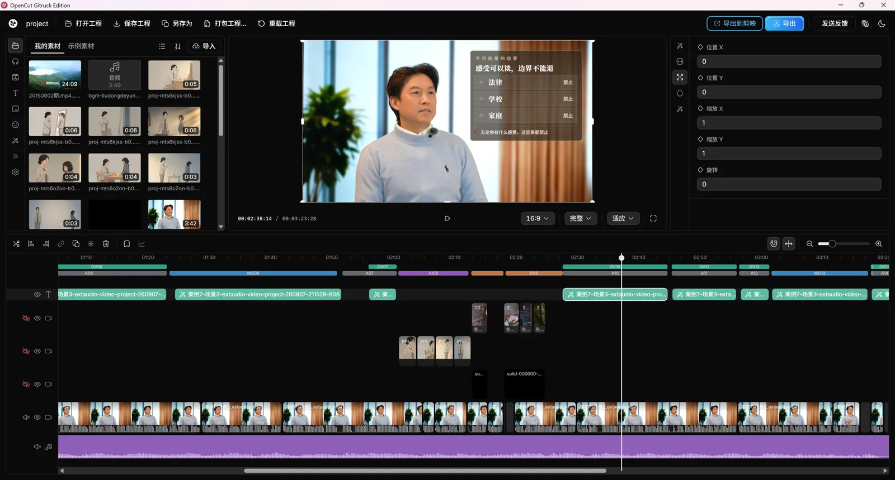
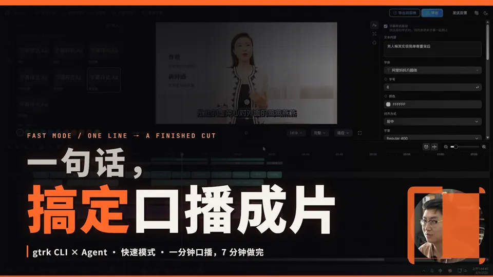
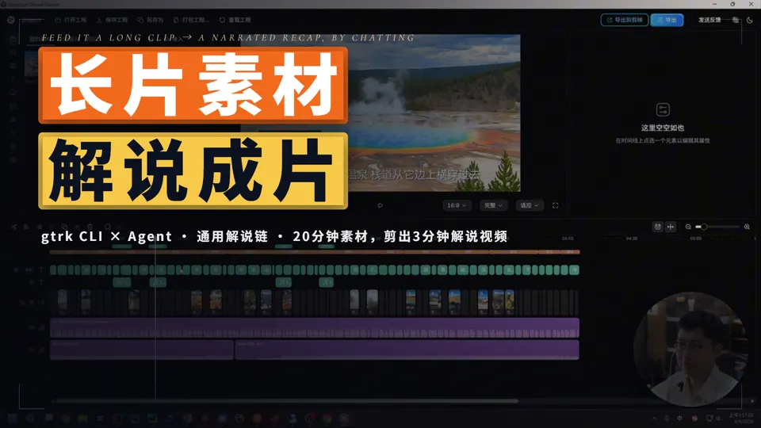
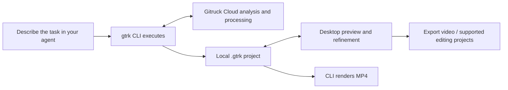

<div align="center">


<h1>Talk your video into shape.</h1>

<p><strong>Give your AI agent the tools to turn footage into an editable video project.</strong></p>
<p>Cut talking heads · Find highlights · Create narrated videos · Add B-roll, motion graphics and captions</p>

<p>
<a href="#demo">Demo</a> ·
<a href="#quick-start">Quick start</a> ·
<a href="https://hocassian.feishu.cn/wiki/HCFpwoF7SivIFbkKosgcFMcEnxk">Tutorials</a> ·
<a href="https://github.com/Gitruck/ai-drama-desk">AI Drama Desk</a> ·
<a href="docs/development.en.md">Develop</a> ·
<a href="README.md">简体中文</a>
</p>

<p>
<a href="https://www.npmjs.com/package/@gitruck/cli"></a>
<a href="https://nodejs.org/"></a>
<a href="LICENSE"></a>

</p>

<p><a href="https://ai-mcn.tv/en/gtrk"><strong>Visit the website ↗</strong></a>　<a href="https://cloud.ai-mcn.tv/zh-CN/download"><strong>Get the desktop client ↗</strong></a>　<a href="https://cloud.ai-mcn.tv/zh-CN/dashboard"><strong>Get an API key ↗</strong></a></p>

</div>

<!-- Bilingual pair: mirror changes in README.md. Detailed parameters live in docs/reference*.md. -->

**gtrk is a video-creation CLI built for AI agents.** Describe what you want in a Skills-enabled agent such as Codex, Claude Code, Cursor or TRAE. Your agent uses gtrk to edit and assemble the project; you preview it, choose footage and refine the details in the desktop client.

Start with a talking-head recording, an interview, a script or a folder of travel footage. Connect rough cutting, B-roll, motion graphics, music and captions into a workflow, or use a single tool on its own. **You make the creative decisions. gtrk handles execution.**

<a id="demo"></a>

## Every step editable. Every layer on the timeline.

<a href="https://www.bilibili.com/video/BV1HAec6fELP/"></a>

<p align="center"><strong>Talk in your agent. See the result in the client.</strong><br>Actual desktop project shown above. <a href="https://www.bilibili.com/video/BV1HAec6fELP/">▶ Watch the 2:28 workflow tour</a></p>

| See a quick run | Follow a full production |
| :---: | :---: |
| [](https://www.bilibili.com/video/BV1PcYK6kEEL/) | [](https://www.bilibili.com/video/BV1iZYK6YEew/) |
| **7-minute quick mode** · Talking head, graphics, music and captions | **35-minute narrated video** · Footage review, script, voiceover and visuals |

<a id="quick-start"></a>

## Install once. Start a conversation.

You need an AI agent that supports Skills and local command execution, plus **Node.js ≥ 20.6**.

```bash
npx @gitruck/cli@latest install
```

The installer sets up gtrk, installs its Skills and guides you through API-key configuration. Get a key from the [Gitruck Cloud dashboard](https://cloud.ai-mcn.tv/zh-CN/dashboard); cloud capabilities require an account and available credit. Open a new agent session afterwards to load the Skills.

Give your agent the footage folder and ask:

> Turn “talk.mp4” into a video. The script is in the same folder. Show me the production plan first.

For a rough cut only:

> Cut a version of this talking-head recording, remove retakes and long pauses, and give me a project I can keep editing in Jianying.

**On Windows, install the desktop client for preview and refinement:** [full installation guide](https://hocassian.feishu.cn/wiki/HCFpwoF7SivIFbkKosgcFMcEnxk) · [download](https://cloud.ai-mcn.tv/zh-CN/download). The CLI runs on Windows, macOS and Linux; the desktop client is currently available for Windows.

<details>
<summary>Direct commands, environment checks and upgrades</summary>

```bash
gtrk oralcut "./talk.mp4" --script "./script.txt"
gtrk transcript "./interview.mp4"
gtrk doctor
gtrk upgrade
```

Media processing requires FFmpeg. Check with `gtrk deps status`; when missing, explicitly run `gtrk deps install` as directed. Existing configuration is preserved. Use `gtrk init --reconfigure` to change it.

[Full configuration and command reference](docs/reference.en.md)

</details>

## See what it can make

These are real examples from the [product page](https://ai-mcn.tv/en/gtrk). Click a cover to watch the result, or compare the talking-head edit with its original footage.

<table>
<tr>
<td width="50%" valign="top">
<a href="https://api.ai-mcn.tv:9000/cloud/static/assets/oralcut/webm/fishing_after.webm"></a>
<strong>Talking heads: raw footage to a finished edit</strong><br>
1:04 → 0:48 · Rough cut, diagrams, gear close-ups and captions.<br>
<a href="https://api.ai-mcn.tv:9000/cloud/static/assets/oralcut/webm/fishing_before.webm">Before</a> · <a href="https://api.ai-mcn.tv:9000/cloud/static/assets/oralcut/webm/fishing_after.webm">After</a> · <a href="https://hocassian.feishu.cn/wiki/Y6Odw4Kz5iPKMxkOOPJc6FyOnpe">Tutorial</a>
</td>
<td width="50%" valign="top">
<a href="https://api.ai-mcn.tv:9000/cloud/static/assets/l2s/webm/huangqin_talking_demo_1_16_9.webm"></a>
<strong>Long to short: give each highlight its own video</strong><br>
A 45-second highlight from a 26:29 interview · Separate landscape and portrait edits.<br>
<a href="https://api.ai-mcn.tv:9000/cloud/static/assets/l2s/webm/huangqin_talking_demo_1_16_9.webm">Landscape</a> · <a href="https://api.ai-mcn.tv:9000/cloud/static/assets/l2s/webm/huangqin_talking_demo_1_9_16.webm">Portrait</a> · <a href="https://hocassian.feishu.cn/wiki/Gls1wTebVi1tpDkeaK8cINqbnMb">Tutorial</a>
</td>
</tr>
<tr>
<td width="50%" valign="top">
<a href="https://api.ai-mcn.tv:9000/cloud/static/assets/narration/travel/webm/3.webm"></a>
<strong>Travel: turn a footage folder into a story</strong><br>
Yellowstone National Park · 3:05 · Footage review, narration, voiceover and visuals.<br>
<a href="https://api.ai-mcn.tv:9000/cloud/static/assets/narration/travel/webm/3.webm">Watch</a> · <a href="https://hocassian.feishu.cn/wiki/CjDPwyLMcimfjDk1c2NcSv3unCf">Tutorial</a>
</td>
<td width="50%" valign="top">
<a href="https://api.ai-mcn.tv:9000/cloud/static/assets/narration/food/webm/1.webm"></a>
<strong>Food: one restaurant, one meal, one video</strong><br>
Teppan pork set meal · 2:36 · Find the story and preserve the atmosphere.<br>
<a href="https://api.ai-mcn.tv:9000/cloud/static/assets/narration/food/webm/1.webm">Watch</a> · <a href="https://hocassian.feishu.cn/wiki/EbY3wo6YhiABCjkhczRcpixVniQ">Tutorial</a>
</td>
</tr>
</table>

[More genres and before/after examples →](https://ai-mcn.tv/en/gtrk)

## Start with what you have

Describe the task. You do not need to memorize commands or Skill names.

| What you have | Ask your agent | Workflow |
| --- | --- | --- |
| One or more talking-head recordings, possibly with external audio | “Make these recordings into an episode. Remove retakes and add graphics and captions.” | [Talking heads](https://hocassian.feishu.cn/wiki/Y6Odw4Kz5iPKMxkOOPJc6FyOnpe) |
| A finished script | “Make a narrated video from this script. Let me choose a voice first.” | [Voiceover](https://hocassian.feishu.cn/wiki/CdpewYDOmialPLkjOmacI97Wnfd) |
| A podcast, course, interview or livestream replay | “Pick self-contained highlights and make separate short-video projects.” | [Long to short](https://hocassian.feishu.cn/wiki/Gls1wTebVi1tpDkeaK8cINqbnMb) |
| Film, gameplay, travel or restaurant footage | “Review the footage, find the highlights, write narration and match the visuals.” | [Narrated videos](https://hocassian.feishu.cn/wiki/CmtRwmqzYi5dRtkWKgDc7ApWnre) |
| A screen recording and a simultaneous presenter recording | “Combine these into a tutorial with a presenter picture-in-picture.” | [Screen + presenter](https://hocassian.feishu.cn/wiki/GO84wbFqOi9W92kzGzpcc3nQnNh) |
| On-location footage with live sound you want to keep | “Make a documentary vlog, preserve the location audio and add narration.” | [Vlog Skill](skills/gtrk-vlog-docu/SKILL.md) |

Long-to-short editing keeps highlights in the original speakers' voices; narrated videos retell the material. See the [workflow guide](docs/workflow.en.md) for steps, deliverables and optional stages.

## Why gtrk

- **Create in your own agent.** Skills organize the workflow; the CLI executes it. You can also use it in scripts and automation.
- **Keep an editable project.** Footage, audio, captions and motion graphics stay in the project. Refine it in the desktop client and export supported elements to Jianying or Premiere.
- **Use your footage and find more.** Search local libraries or platform footage by script, lay candidates on the timeline and choose segment by segment.
- **Reuse your show's style.** Carry typography, colors, visual language and creative rules into the next episode through your own Skills and show configuration.

## One project throughout



**Conversations currently happen in your own agent; the desktop client has no built-in AI chat.** Review and refine the project in the client after your agent changes it, or render with `gtrk render`. Motion graphics that require cloud rendering are billed separately; cached renders can be reused.

The three-format rough-cut output and the export of a fully packaged project have different support boundaries. The [workflow guide](docs/workflow.en.md) explains where each deliverable opens and which effects need rendering.

## gtrk + AI Drama Desk: from storyboard to editable clips

For AI-generated story scenes, connect [Gitruck AI Drama Desk](https://github.com/Gitruck/ai-drama-desk) to the same project workflow. The responsibilities stay separate:

| Component | What it does | Output |
| --- | --- | --- |
| `gtrk CLI` | Understands the request in your agent, orchestrates workflows and manages `.gtrk` projects | An editable video project |
| `AI Drama Desk` | Imports storyboards, manages characters and styles, generates keyframes / I2V clips and exports a handoff package | A `return-v1` clip package + `manifest` |
| `gtrk ai-drama lay` | Places exported clips back into the project by beat windows | A dedicated AI video track |

The typical path looks like this:

```text
storyboard.md → AI Drama Desk → references / keyframes / I2V → return-v1 package
                                                                  ↓
                                      gtrk ai-drama lay → .gtrk project → client refinement
```

The desk supports mock, cloud and optional local ComfyUI engines. Start with a zero-GPU, zero-key rehearsal, then enable a real engine when needed. For an existing desk project, the CLI only needs the **API base and project ID**; it does not scan the repository:

```bash
gtrk ai-drama lay --project ./my-video --desk-project <project-id>
```

→ [AI Drama Desk README](https://github.com/Gitruck/ai-drama-desk) · [AI drama tutorial](https://hocassian.feishu.cn/wiki/FRAKwUvBWib2vrkqZ5XcLDRqnOe) · [command reference](docs/reference.en.md#command-reference)

## Use just one tool, too

| What you need | Start here |
| --- | --- |
| Matting, denoising, vocal separation, upscaling, interpolation, image motion or video dubbing | [Toolbox](https://hocassian.feishu.cn/wiki/Uh19wAphailtSqkt6jsclW0Rnie) · `gtrk tool list` |
| Covers in multiple aspect ratios | [Cover workflow](https://hocassian.feishu.cn/wiki/AD5bwUAHris75vkWl4DcsvPJntb) |
| A spectrum video for a song | [Music visualizer Skill](skills/gtrk-music-visualizer/SKILL.md) |
| A visual style for your show | [Style-maker Skill](skills/gtrk-style-maker/SKILL.md) |
| Third-party animation, typography or creative Skills | [Skill map](https://hocassian.feishu.cn/wiki/SxRtwJ0G7inTbQkwckFcZmClnrd) |

## FAQ

**Do I need to code?**

No. Describe your task to your agent. It will guide you when installation, configuration or costs require your input.

**Does open source mean every service is free?**

The CLI is MIT-licensed. Gitruck Cloud capabilities follow their own billing rules; your agent and third-party generation services may charge separately. See the [dashboard](https://cloud.ai-mcn.tv/zh-CN/dashboard) and [billing guide](https://hocassian.feishu.cn/wiki/Iq9NwC3briQ2TJkSrzPcm5Jensd) for current credit and pricing.

**Will my original video be uploaded?**

Talking-head and long-to-short project workflows keep the original locally and upload extracted audio by default. Visual assistance or smart split-screen uploads a compressed proxy. Tools that process or render video in the cloud may upload the video; check the individual tool's instructions.

**Do I have to use the Windows desktop client?**

The CLI runs across platforms. The Windows client provides visual preview and refinement; the CLI can render existing projects. Jianying and Premiere support depends on the installed software and the project format.

**Skills are missing, or a task failed. What now?**

Open a new agent session and run `gtrk doctor`. Use `gtrk skills install` to refresh Skills. If a task already has an ID, recover its results before submitting it again. See [workflow and troubleshooting](docs/workflow.en.md).

## Star History

<a href="https://star-history.com/#Gitruck/cli&Date">
  <picture>
    <source media="(prefers-color-scheme: dark)" srcset="https://api.star-history.com/svg?repos=Gitruck/cli&type=Date&theme=dark" />
    <source media="(prefers-color-scheme: light)" srcset="https://api.star-history.com/svg?repos=Gitruck/cli&type=Date" />
    
  </picture>
</a>

## Documentation and contributions

[Full tutorials](https://hocassian.feishu.cn/wiki/HCFpwoF7SivIFbkKosgcFMcEnxk) · [Workflow](docs/workflow.en.md) · [Command reference](docs/reference.en.md) · [Development](docs/development.en.md) · [Changelog](CHANGELOG.md)

Report bugs and suggest improvements through [Issues](https://github.com/Gitruck/cli/issues). Contributions to documentation, examples and code are welcome. Business inquiries: [business@gitruck.com](mailto:business@gitruck.com).

[MIT license](LICENSE) · [User agreement](https://hocassian.feishu.cn/wiki/T6UywR8b3ik4Mgk7tP9c1b7Kn0b) · [Privacy policy](https://hocassian.feishu.cn/wiki/ZLRNwlEhfishYtkosUhcofMYnPf)

<p align="center">If gtrk saves you editing time, give it a Star to help other creators find it.</p>
