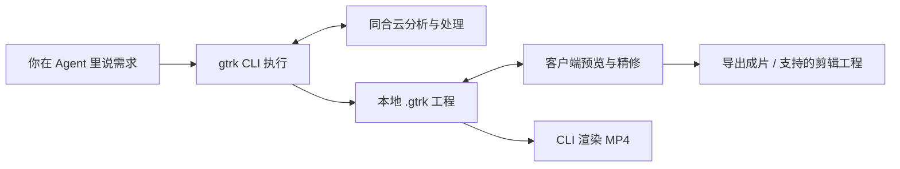

<div align="center">


<h1>一句句把片子聊出来</h1>

<p><strong>让你的 AI Agent，把素材做成可以继续精修的视频工程。</strong></p>
<p>剪口播 · 切高光 · 做解说 · 配画面 · 叠动效 · 上字幕</p>

<p>
<a href="#demo">观看演示</a> ·
<a href="#quick-start">快速开始</a> ·
<a href="https://hocassian.feishu.cn/wiki/HCFpwoF7SivIFbkKosgcFMcEnxk">使用教程</a> ·
<a href="docs/development.md">开发文档</a> ·
<a href="README.en.md">English</a>
</p>

<p>
<a href="https://www.npmjs.com/package/@gitruck/cli"></a>
<a href="https://nodejs.org/"></a>
<a href="LICENSE"></a>

</p>

<p><a href="https://ai-mcn.tv/gtrk"><strong>产品主页 ↗</strong></a>　<a href="https://cloud.ai-mcn.tv/zh-CN/download"><strong>下载客户端 ↗</strong></a>　<a href="https://cloud.ai-mcn.tv/zh-CN/dashboard"><strong>获取 API Key ↗</strong></a></p>

</div>

<!-- 中英双份：修改本页须同步 README.en.md，详细参数维护在 docs/reference*.md。 -->

**gtrk 是为 AI Agent 准备的视频创作 CLI。** 在 Codex、Claude Code、Cursor、TRAE 等支持 Skills 的 Agent 里说需求，Agent 调用 gtrk 完成剪辑与装配，你在客户端里看效果、挑素材、调细节。

从一条口播、一场访谈、一篇稿子或一组旅拍素材开始。把粗剪、配画面、动态图、配乐和字幕接成工作流，也可以单独调用其中一个工具。**你负责创意和判断，gtrk 负责执行。**

<a id="demo"></a>

## 每一步都能改，每一层都在轨上

<a href="https://www.bilibili.com/video/BV1HAec6fELP/"></a>

<p align="center"><strong>在 Agent 里说需求，在客户端里看效果。</strong><br>上图为真实客户端工程。<a href="https://www.bilibili.com/video/BV1HAec6fELP/">▶ 2 分 28 秒，看完整条路</a></p>

| 先看一次实测 | 再看完整制作 |
| :---: | :---: |
| [](https://www.bilibili.com/video/BV1PcYK6kEEL/) | [](https://www.bilibili.com/video/BV1iZYK6YEew/) |
| **7 分钟快速模式** · 口播、字卡、BGM、字幕 | **35 分钟解说实战** · 看素材、写稿、配音、配画面 |

<a id="quick-start"></a>

## 安装一次，开始对话

准备一个支持 Skills、能执行本地命令的 AI Agent，以及 **Node.js ≥ 20.6**。

```bash
npx @gitruck/cli@latest install
```

安装器会配置 gtrk、安装配套 Skills，并引导填写 API Key。Key 在[同合云控制台](https://cloud.ai-mcn.tv/zh-CN/dashboard)获取；调用云端能力需要账户和可用额度。完成后重新打开 Agent 会话，让新 Skills 生效。

把素材文件夹交给 Agent，然后说：

> 帮我把「口播.mp4」做成一期视频，文字稿在同目录。先给我看制作方案。

只想先粗剪，也可以说：

> 把这条口播剪一版，去掉重复和长停顿，给我能在剪映里继续改的工程。

**Windows 推荐同时安装桌面客户端**，用于预览和精修：[全套安装指南](https://hocassian.feishu.cn/wiki/HCFpwoF7SivIFbkKosgcFMcEnxk) · [客户端下载](https://cloud.ai-mcn.tv/zh-CN/download)。CLI 支持 Windows、macOS、Linux；桌面客户端目前提供 Windows 版。

<details>
<summary>直接用命令、检查环境与升级</summary>

```bash
gtrk oralcut "./talk.mp4" --script "./script.txt"
gtrk transcript "./interview.mp4"
gtrk doctor
gtrk upgrade
```

音视频处理需要 FFmpeg。用 `gtrk deps status` 检查；缺少时按提示显式运行 `gtrk deps install`。已有配置会保留，需要修改时用 `gtrk init --reconfigure`。

[完整配置与命令参考](docs/reference.md)

</details>

## 看看它能做什么

下面选用与[产品专页](https://ai-mcn.tv/gtrk)一致的真实案例。点击封面观看成片，口播示例也可打开原片对比。

<table>
<tr>
<td width="50%" valign="top">
<a href="https://api.ai-mcn.tv:9000/cloud/static/assets/oralcut/webm/fishing_after.webm"></a>
<strong>口播：从毛片到包装成片</strong><br>
1:04 → 0:48 · 粗剪、结构图解、器材特写、字幕。<br>
<a href="https://api.ai-mcn.tv:9000/cloud/static/assets/oralcut/webm/fishing_before.webm">看原片</a> · <a href="https://api.ai-mcn.tv:9000/cloud/static/assets/oralcut/webm/fishing_after.webm">看成片</a> · <a href="https://hocassian.feishu.cn/wiki/Y6Odw4Kz5iPKMxkOOPJc6FyOnpe">口播教程</a>
</td>
<td width="50%" valign="top">
<a href="https://api.ai-mcn.tv:9000/cloud/static/assets/l2s/webm/huangqin_talking_demo_1_16_9.webm"></a>
<strong>长剪短：让好话题单独成片</strong><br>
26:29 访谈中的 45 秒高光 · 横竖屏分别制作。<br>
<a href="https://api.ai-mcn.tv:9000/cloud/static/assets/l2s/webm/huangqin_talking_demo_1_16_9.webm">横屏成片</a> · <a href="https://api.ai-mcn.tv:9000/cloud/static/assets/l2s/webm/huangqin_talking_demo_1_9_16.webm">竖屏成片</a> · <a href="https://hocassian.feishu.cn/wiki/Gls1wTebVi1tpDkeaK8cINqbnMb">长剪短教程</a>
</td>
</tr>
<tr>
<td width="50%" valign="top">
<a href="https://api.ai-mcn.tv:9000/cloud/static/assets/narration/travel/webm/3.webm"></a>
<strong>旅拍：把一组素材讲成故事</strong><br>
黄石国家公园 · 3:05 · 素材理解、解说、配音与画面。<br>
<a href="https://api.ai-mcn.tv:9000/cloud/static/assets/narration/travel/webm/3.webm">看成片</a> · <a href="https://hocassian.feishu.cn/wiki/CjDPwyLMcimfjDk1c2NcSv3unCf">旅拍教程</a>
</td>
<td width="50%" valign="top">
<a href="https://api.ai-mcn.tv:9000/cloud/static/assets/narration/food/webm/1.webm"></a>
<strong>美食：一家店，一顿饭，一条片子</strong><br>
铁板炒肉定食 · 2:36 · 提炼看点、保留现场、重述故事。<br>
<a href="https://api.ai-mcn.tv:9000/cloud/static/assets/narration/food/webm/1.webm">看成片</a> · <a href="https://hocassian.feishu.cn/wiki/EbY3wo6YhiABCjkhczRcpixVniQ">美食教程</a>
</td>
</tr>
</table>

[更多题材与前后对照 →](https://ai-mcn.tv/gtrk)

## 从你的素材开始

不用记命令或 Skill 名字，直接描述想做的事。

| 你手上有什么 | 对 Agent 说 | 工作流 |
| --- | --- | --- |
| 一条或几条口播，可能还有外录音频 | “把这些口播做成一期，剪掉重录，配上字卡和字幕。” | [口播](https://hocassian.feishu.cn/wiki/Y6Odw4Kz5iPKMxkOOPJc6FyOnpe) |
| 一篇已经写好的稿子 | “用这篇稿子做条配音视频，先给我选音色。” | [配音](https://hocassian.feishu.cn/wiki/CdpewYDOmialPLkjOmacI97Wnfd) |
| 播客、课程、访谈或直播回放 | “挑出值得单发的话题，做成几条短片工程。” | [长剪短](https://hocassian.feishu.cn/wiki/Gls1wTebVi1tpDkeaK8cINqbnMb) |
| 影视、游戏、旅拍或探店素材 | “看完这些素材，提炼看点，写解说并配画面。” | [通用解说](https://hocassian.feishu.cn/wiki/CmtRwmqzYi5dRtkWKgDc7ApWnre) |
| 录屏和同时录制的人像 | “把录屏合进来，做成讲师画中画。” | [录屏画中画](https://hocassian.feishu.cn/wiki/GO84wbFqOi9W92kzGzpcc3nQnNh) |
| 一批现场素材，想保留同期声 | “把这批素材做成纪实 Vlog，保留现场声音，再补旁白。” | [Vlog Skill](skills/gtrk-vlog-docu/SKILL.md) |

长剪短保留原声高光；解说会提炼素材并重新讲述。具体流程、交付文件和可选环节见[工作流指南](docs/workflow.md)。

## 为什么用 gtrk

- **在你熟悉的 Agent 里创作。** 配套 Skills 负责组织步骤，CLI 负责执行；也能直接接入脚本和自动化流程。
- **工程留在手里。** 画面、音频、字幕和动效写进可编辑工程。你可以在客户端继续调整，并按支持范围导出到剪映、Premiere。
- **用自己的素材，也能找新画面。** 按文稿检索本地素材库或平台素材，将候选铺到时间线上，逐段挑选。
- **栏目风格可以复用。** 字体、配色、画面语言和创作规则可通过自己的 Skills 与栏目配置延续到下一期。

## 一份工程，贯穿全程



**当前对话入口在你自己的 Agent 中，客户端没有内置 AI 对话框。** Agent 修改工程后，在客户端查看效果、继续精修；也可以用 `gtrk render` 渲染成片。需要云端渲染的动态图会单独计费，缓存可复用。

粗剪阶段的三端工程，与完整包装后的导出支持范围不同；[工作流指南](docs/workflow.md)说明每种交付物在哪打开、哪些效果需要渲染。

## 成片之外，也能只做一件事

| 想做什么 | 从这里开始 |
| --- | --- |
| 抠像、降噪、人声分离、超分、补帧、图片运镜、视频译制 | [单点工具箱](https://hocassian.feishu.cn/wiki/Uh19wAphailtSqkt6jsclW0Rnie) · `gtrk tool list` |
| 做一套多尺寸封面 | [封面工作流](https://hocassian.feishu.cn/wiki/AD5bwUAHris75vkWl4DcsvPJntb) |
| 把一首歌做成频谱视频 | [音乐可视化 Skill](skills/gtrk-music-visualizer/SKILL.md) |
| 给自己的栏目建立视觉风格 | [风格体系 Skill](skills/gtrk-style-maker/SKILL.md) |
| 接入第三方动画、排版或创作 Skills | [Skill 地图](https://hocassian.feishu.cn/wiki/SxRtwJ0G7inTbQkwckFcZmClnrd) |

AI 再现与 AI 漫剧可接入外部生成平台或独立工作台，生成的片段再回到工程；相关生成服务及依赖需另行准备。[查看 AI 漫剧教程](https://hocassian.feishu.cn/wiki/GkZwwOy36iND5ZkIQDEcQ6zRnEA)

## 常见问题

**需要会写代码吗？**

不需要。日常使用可以直接对 Agent 描述需求。安装、配置或费用需要你提供信息时，Agent 会引导你完成。

**开源等于所有服务免费吗？**

CLI 代码采用 MIT 许可证；同合云能力按对应规则计费，你使用的 Agent 和第三方生成服务也可能单独收费。价格与额度以[控制台](https://cloud.ai-mcn.tv/zh-CN/dashboard)和[计费说明](https://hocassian.feishu.cn/wiki/Iq9NwC3briQ2TJkSrzPcm5Jensd)为准。

**原始视频会被上传吗？**

口播粗剪和长剪短工程流程保留本地原片，默认上传提取的音频；开启视觉辅助或智能分屏时上传压缩代理视频。云端直接处理或渲染的工具可能需要上传视频，按具体工具说明执行。

**一定要用 Windows 客户端吗？**

CLI 可以跨平台执行。Windows 客户端用于可视化预览与精修；已有工程也可通过 CLI 渲染。剪映、Premiere 的使用取决于对应软件和工程格式的支持情况。

**安装后找不到 Skills，或任务出错怎么办？**

重新打开 Agent 会话，运行 `gtrk doctor` 检查环境；补装用 `gtrk skills install`。任务已有 ID 时优先恢复结果，避免重新提交云端任务。详见[工作流与排障](docs/workflow.md)。

## 文档与参与

[完整教程](https://hocassian.feishu.cn/wiki/HCFpwoF7SivIFbkKosgcFMcEnxk) · [工作流](docs/workflow.md) · [命令参考](docs/reference.md) · [开发文档](docs/development.md) · [更新日志](CHANGELOG.md)

欢迎通过 [Issues](https://github.com/Gitruck/cli/issues)反馈问题和提出建议，或提交文档、示例与代码改进。商务联系：[business@gitruck.com](mailto:business@gitruck.com)。

[MIT 许可证](LICENSE) · [用户协议](https://hocassian.feishu.cn/wiki/T6UywR8b3ik4Mgk7tP9c1b7Kn0b) · [隐私政策](https://hocassian.feishu.cn/wiki/ZLRNwlEhfishYtkosUhcofMYnPf)

<p align="center">如果 gtrk 帮你省下了剪辑时间，欢迎点个 Star，让更多创作者找到它。</p>
