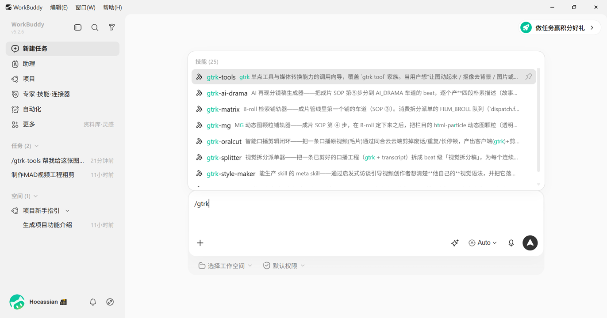
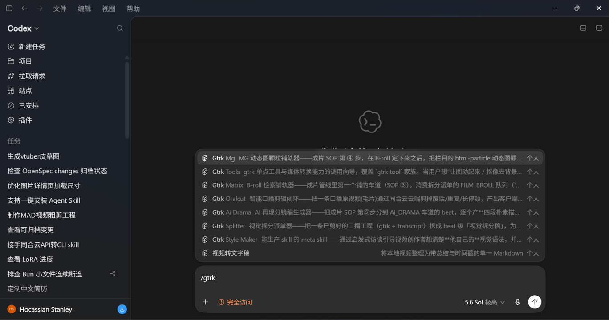
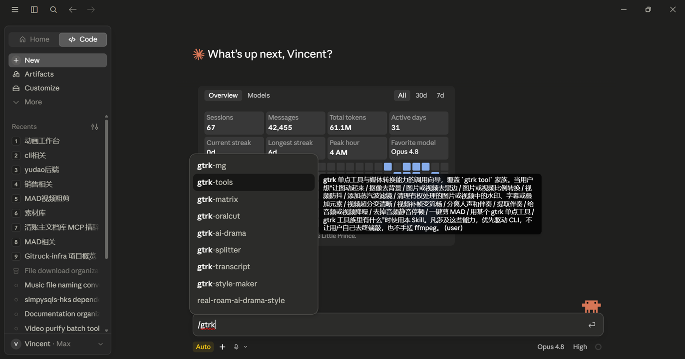
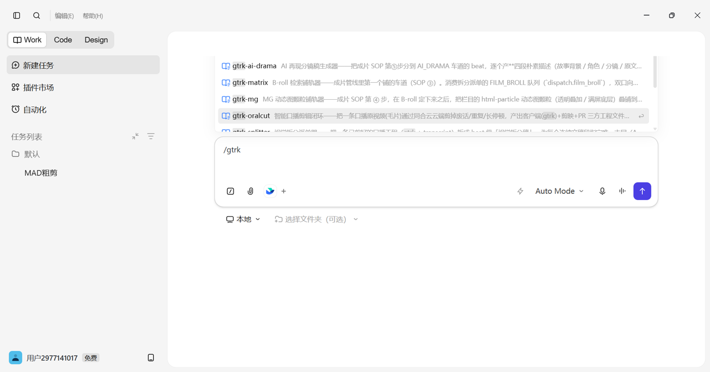

# gtrk-cli（原·同合智创工具箱）

> 同合云成片流水线 CLI —— **agent 驱动云端任务、产物拉回本地、三方工程文件（客户端 / 剪映 / PR）互通**。
>
> 一条命令，把口播毛片变成可二次精修的剪辑工程。云端做重活，本地只装配，源视频不出本地。

**🔗 [官网](https://cloud.ai-mcn.tv/zh-CN/cli) · [使用教程](https://hocassian.feishu.cn/wiki/HCFpwoF7SivIFbkKosgcFMcEnxk) · [快速开始](https://cloud.ai-mcn.tv/zh-CN/docs/quick-start) · [客户端下载](https://cloud.ai-mcn.tv/zh-CN/download) · [npm](https://www.npmjs.com/package/@gitruck/cli)**


---

## 为什么用 gtrk-cli

- **一条命令出三方工程**：上传口播毛片 → 云端智能剪辑（剪废话 / 重复 / 长停顿）→ 拉回**客户端（gtrk）+ 剪映 + PR/FCP** 三方工程文件 → 自动打开产物目录。
- **云端做重活、本地只装配**：识别、剪辑、对齐都在云端；本地只拿结果，**源视频不出本地**（路径写进工程、本地打开直接认素材）。
- **为 agent 而生**：配套 skill `gtrk-oralcut`，在 Claude Code / Codex / Cursor / Gemini CLI / TRAE 等 Agent 里一句「帮我剪个口播」就能发起，CLI 是手、agent 是脑。
- **通用工具箱**：单 binary + 平行子命令——每个 `gtrk <xyz>`（oralcut / split / mg / matrix / render…）都是一个**业务无关的通用驱动器/工具**，成片流程要哪个启哪个、用不到放着；后续可长更多驱动器。对标飞书 `lark-cli`。目前用它做人文社科视频，但设计上不绑任何栏目。

## 功能

| | 命令 | 做什么 |
|---|---|---|
| 🎬 | `gtrk oralcut <毛片>` | 智能口播剪辑闭环：一次出 gtrk + 剪映 + PR 三方工程，自动打开 |
| ✂️ | `gtrk long2short <毛片>` | 长剪短闭环：长视频语义选段+跳剪（可选 720p 代理智能分屏）→ 逐 clip 出 gtrk + 剪映 + PR 三方工程（毛片不上传） |
| 📝 | `gtrk transcript <本地视频>` | 视频转文字稿：原视频不上传，只传本地抽取音频，生成一个含总结、时码记录和纯文本的 Markdown |
| 🎵 | `gtrk music-visualizer <音频>` | 音乐可视化：一首歌 → 频谱可视化成片（`--template` 必填 + 可选背景/封面 + 模板/配色样式），配套 driver skill `gtrk-music-visualizer` |
| ✂️ | `gtrk split [拆分稿]` | 视觉拆分派单器：成片 × transcript 投影 → beat 分镜校验落地（`struct_meta.split` + `dispatch.json`），驱动四车道派单；`--column <id>` 按栏目词表校验 |
| ⚙️ | `gtrk init` | 引导式一次性配置（API Key + 剪映草稿目录），之后免管 |
| 🩺 | `gtrk doctor` | 体检：配置 / 云端连通 / 剪映目录 / 运行时一键自检 |
| 🤖 | `gtrk skills install` | 通过通用 `skills` 适配器和 gtrk 补充层，把 10 个 CLI 自带 skill 装进本机检测到的主流 Agent；`--all` 可覆盖全部已登记宿主 |
| ⬆️ | `gtrk upgrade` | 升级 CLI 到最新版 + 刷新 skill（配置保留）；`--check` 只查不装 |
| 🎞️ | `gtrk render` | 本地渲染 gtrk 工程（EDL）→ 成片 mp4（需 ffmpeg） |
| 🔎 | `gtrk matrix` | B-roll 检索+**候选铺轨**：消费 FILM_BROLL 派单 → 产候选清单 + 下载 preview 代理铺 N 条候选轨（`--lay N` 默认 1，opencut 打开即可用轨道小眼睛对比；`--lay 0` 只出清单）；`matrix search "<词>"` 单条 ad-hoc |
| 🎨 | `gtrk mg` | MG 动态图颗粒铺轨：消费 MG 派单 → 把 html-particle 颗粒（透明叠加 / 满屏底层，由你栏目的 MG 生产 skill 所产）铺进 `.gtrk` 的 beat_track；`mg lint <颗粒.html>` 铁律静态子集校验、`mg status --project <dir>` 编排看板（缺 HTML / 已产未铺 / 已铺）；aux 叠层颗粒同段多铺（一 beat 派生主 + `-aux<n>`）。旧名 `gtrk rrv` 保留为弃用别名 |
| 🧰 | `gtrk tool <name>` | 单点工具族：图转运镜、图片/视频抠像、图片去黑边/比例转换/净化/转方图/LivePhoto、智能拼图封面/拼长图（多图输入）、视频去黑边/比例转换/防抖/蒸汽波滤镜/机械·智能分镜/运镜高光/智能字幕、人声伴奏分离/说话人分轨/变调变速、钢琴转MIDI/修复、音视频降噪、静音移除、MAD 等；`gtrk tool list` 查全部输入/产物/实时价格/状态。单发单收、共享 runner，接新工具只加一个 descriptor |
| 🚧 | `struct` | （规划中）已有 gtrk 转三方工程 |

---

## 获取 API Key

CLI 要调用同合云云端能力，需先拿一个 API Key（形如 `gc_xxxxxxxx`）：

1. 打开官网 **[cloud.ai-mcn.tv](https://cloud.ai-mcn.tv)** 并登录 —— **登录即开通**、自带免费测试额度、零门槛。
2. 进入 **[控制台](https://cloud.ai-mcn.tv/zh-CN/dashboard)**，在「API 密钥 / 密钥管理」处生成并复制你的 Key。
3. 下一步 `gtrk install` 会让你把它粘进去（一次配好、本地长期复用）。

> 快速开始文档：[cloud.ai-mcn.tv/zh-CN/docs/quick-start](https://cloud.ai-mcn.tv/zh-CN/docs/quick-start) · 对接咨询：business@migotimes.com

## 安装 & 快速上手

需要 Node.js ≥ 20.6（`node -v` 查看）。

```bash
# 1) 一条命令装全：命令行 gtrk + /gtrk-oralcut skill + 配置（填 API Key、自动扫剪映目录）
npm i -g @gitruck/cli@latest && gtrk install
#   或免全局安装直接用：npx @gitruck/cli@latest install

# 2) 剪一条（剪完自动打开产物目录）
gtrk oralcut "D:/素材/某选题-原始口播.mp4" --script "D:/素材/某选题-文字稿.txt"

# 或把本地视频转成一个 Markdown 文字稿
gtrk transcript "D:/素材/采访视频.mp4"
```

> 只想配置、不装 skill：用 `gtrk init`。本地开发：`cd gtrk-cli && bun install && bun run src/index.ts <命令>`。

产物目录形如 `<毛片名>-video-project-<YYMMDD-HHMMSS>/`，内含 `gtrk/`、`jianying/`、`xml/` 三端工程。

> **重复装不会重复填配置**：`gtrk install` / `gtrk init` 检测到已配好就默认保留、只刷新 skill；想改配置加 `--reconfigure`（Key / 剪映目录也都能回车沿用）。

## 操作地图：从零到成片

> **你只管对话，敲 CLI 的活交给 agent。** 下面是一条龙的走法——先做什么、后做什么、遇到情况怎么办。

**一次性准备（装一次，之后免管）**

1. **装 CLI**：`npm i -g @gitruck/cli@latest && gtrk install`（装 gtrk + skill + 填 API Key，一次配好）。
2. **（可选）建栏目风格**：想要自己的视觉调性 / 词表，对 agent 说「**建我栏目的风格体系**」（`/gtrk-style-maker` 访谈式帮你落成你自己的 skill 家族 + 栏目配置）。**不建就用默认厨房**，端到端照常跑。

**每片一条龙（有先后的 SOP，对 agent 说话、每步你可介入——不是一次性并行铺完）**

各车道**按次序铺、每步留检查点**：先铺 B-roll 定底层 → 你调好 → 再把 MG 叠上去 → 最后上 AI 再现。你对话推进每一步，agent 替你跑对应命令。

| 步 | 你对 agent 说 | agent 替你做 | 你可以介入 |
|:--:|---|---|---|
| ① | 「帮我把这条口播**剪一版**」 | `/gtrk-oralcut` → `gtrk oralcut` → 三方工程 + transcript | — |
| ② | 「接着**拆分镜派单**」 | `/gtrk-splitter` → `gtrk split` → `dispatch.json` 四车道 | 核对派单结果 |
| ③ | 「**先铺 B-roll**」 | `/gtrk-matrix` → `gtrk matrix` → 候选轨铺入 | **opencut 里挑选/调整 B-roll**（小眼睛切换对比） |
| ④ | 「B-roll 定了，**铺 MG**」 | `/gtrk-mg` → `gtrk mg` → MG 颗粒叠在 B-roll 之上 | 精修颗粒（opencut 手调） |
| ⑤ | 「**上 AI 再现**」 | `/gtrk-ai-drama`（skill，无命令）→ 四段描述稿（中英分块） | 外部平台出片、片段手动回铺 |
| ⑥ | 「**出成片**」 | 客户端出片链（多车道合成 + 颗粒云渲 / 导剪映）；`gtrk render` 只出**主轨快照预览** | 客户端里精修定稿 |

> 次序有理由：**MG 叠在 B-roll 之上**，要先把底层 B-roll 定下来、你满意了再铺 MG；AI 再现最后上。用不到的车道跳过（`dispatch` 里该队列为空就不铺）。
>
> ③④⑤⑥ 都要**回到客户端**挑选 / 精修 / 回铺 / 出片——CLI 把料铺进 `.gtrk`，客户端把 `.gtrk` 出成片。详见下文「**CLI × 客户端**」小节。

**遇到情况怎么办**

| 情况 | 怎么做（跟 agent 说，或 agent 自动） |
|---|---|
| 只想要剪辑工程、暂不做视觉 | 到「剪一版」就停：「先只要剪辑工程」 |
| 报告丢了 / 换台机器再拉产物 | 「用 taskId 取回上次的」→ `gtrk oralcut-result <taskId>`（跳过重跑云端） |
| 想在几个 B-roll 候选里挑 | 「B-roll 多铺几条候选」→ `gtrk matrix --lay N`，opencut 里用轨道小眼睛切换对比 |
| B-roll 填充太差 / 有空槽 | 调 `--score-floor` / `--top-k` 重跑，或「单独搜个词」→ `matrix search "<词>"` 补 |
| 画面 / 颗粒要逐帧精修 | opencut 打开工程手调（agent 铺好的是**可编辑工程**，不是死片） |
| 连不上 / 配置出问题 | 「体检一下」→ `gtrk doctor`（配置 / 云端 / 剪映目录 / 版本一键自检） |
| 有新版 | 「升级」→ `gtrk upgrade`（升 CLI + 刷 skill，配置保留） |

## CLI × 客户端：手脑分工、一份 `.gtrk` 贯穿全程

**标准工作流从来不是「只用 CLI」，而是 CLI + 桌面客户端相互配合——客户端是成片流程绕不过去的一环。** 二者分工：

- **CLI = 无头装配器（手/机械活）**：把云端剪辑产物、检索到的 B-roll、栏目产的颗粒，确定性地装进工程、原子写回 `.gtrk`（剪口播 / 拆分派单 / 铺 B-roll 候选轨 / 铺 MG 颗粒）。不做审美判断、不出最终成片。
- **桌面客户端 = 有头工作台（眼/精修活）**：打开**同一份 `.gtrk`**，让你看、挑、逐帧精修、回铺 AI 片段、出片。装法见上一节「升级 → 桌面客户端」的一键脚本（OpenCut Gitruck Edition）。

**`.gtrk` 是两者之间的交接介质**——它是同合云的统一工程契约（timeline 真超集 + HTML 颗粒 + `struct_meta`），**CLI 写、客户端读，双向**。所以一条片子是 CLI 与客户端**交替推进**的：

```
CLI 写 .gtrk ─▶ 客户端打开(自动感知外部改动、先存脏改再刷新、不丢稿)
   ─▶ 你在客户端挑/调/精修 ─▶ 需要就再喊 agent 让 CLI 写下一轮(铺 MG / 铺 AI…)
   ─▶ … 反复 … ─▶ 客户端出片
```

**这几件事只能在客户端做（CLI 给不了）：**

| 环节 | 为什么必须在客户端 |
|---|---|
| **B-roll 候选挑选** | `gtrk matrix` 铺 N 条候选轨，用轨道**小眼睛**逐条切换对比、选定、删多余——审美取舍只能人在客户端做 |
| **MG / 颗粒精修** | 客户端里 html-particle **活颗粒透明预览** + Transform/Blending/Effects 参数逐帧微调 |
| **口播精剪** | 磁性主轨 ripple、手动微调切点 / 停顿 / 分屏 |
| **AI 再现回铺** | 外部平台出的 AI 片段**手动拖进 AI_DRAMA 车道**对齐区间（`/gtrk-ai-drama` 只吐描述稿，片在外部平台出，见 SOP ⑤） |
| **最终出片** | 多车道合成（overlay / MG / particle 云渲叠起来）+ 剪映草稿导出，都在客户端出片链 |

> **`gtrk render` ≠ 最终成片。** `gtrk render` 是本地 ffmpeg 出**主轨（口播粗剪）的快照预览**——只合主视频轨 + 音轨，**不合成 overlay（B-roll 候选）/ MG 颗粒 / AI 再现**。要出**真正的多车道成片**（各车道叠起来、颗粒云渲、导剪映草稿），走**客户端出片链**。一句话：**CLI 管「把料铺进工程」，客户端管「把工程出成片」。**

## 升级

**CLI + skill**（配置原样保留）：

```bash
gtrk upgrade          # 有新版则升到最新 + 刷新 skill
gtrk upgrade --check  # 只看有没有新版，不动手
```

> 用 `npx` 的（没全局装）本就每次拉最新：`npx @gitruck/cli@latest install`。`gtrk doctor` 也会顺带提示「有新版可升级」。

**桌面客户端**：重跑一键安装脚本即覆盖装最新版（per-user、免管理员、配置不动）：

```powershell
irm https://api.ai-mcn.tv:9000/broadcast/exe/install.ps1 | iex
```

## 给 AI Agent 用

装好后，在各家 Agent 里一句话就能调用 gtrk 的 skill：

| | |
|:--:|:--:|
|  |  |
|  |  |

`gtrk install` 会把 11 个 CLI 自带 skill（`gtrk-oralcut`·`gtrk-long2short`·`gtrk-splitter`·`gtrk-matrix`·`gtrk-mg`·`gtrk-ai-drama`·`gtrk-style-maker`·`gtrk-transcript`·`gtrk-tools`·`gtrk-music-visualizer`·`gtrk-cover`)装进本机检测到的 Agent。实现方式与 lark-cli 一致：gtrk 把本地 skill 源交给通用 `skills` CLI，由它维护 Agent 探测、目录映射及更新规则；gtrk 不再硬编码各家路径。

默认使用 `~/.agents/skills` 作为统一正本，再链接到各 Agent 的兼容目录（Windows 使用 junction）；链接不可用时适配器会回退复制。这样更新只有一份正本，不会让多份副本逐渐漂移。常用命令：

```bash
# 自动探测已安装的 Agent（等价核心：npx -y skills add <gtrk包根>/skills -g -y）
gtrk skills install

# 只装指定宿主；这里使用通用 skills CLI 的 Agent ID
gtrk skills install --agents codex,cursor,gemini-cli,trae-cn

# 安装到适配器当前支持的全部 Agent（会创建较多宿主目录）
gtrk skills install --all

# 不使用链接，每个宿主各复制一份
gtrk skills install --copy
```

`--agents` 接受上游适配器和 gtrk 补充层的 Agent ID。国产 Agent 已覆盖 `trae`、`trae-cn`、`codebuddy`、`qoder`、`qoder-cn`、`qwen-code`、`kimi-code-cli`、`iflow-cli`、`codearts-agent`、`lingma`，并额外补充上游尚未登记的 `workbuddy`、`qoderwork`、`comate`。常见简写 `qwen`、`kimi`、`iflow`、`codearts`、`tongyi-lingma`、`qoder-work`、`baidu-comate` 也会自动映射。以后上游新增 Agent，gtrk 无须发版也能直接使用新 ID；已有脚本若必须写死一个目录，仍可用 `--dir <skills目录>` 走兼容复制模式。

不同 Agent 的**输入 UI 不统一**：Claude 常把 skill 名放进 `/` 补全；Codex 的不同客户端可从 `$`、`/skills` 或 Skills 面板进入；TRAE 以 Skills 设置、显式点名或语义触发为主。因此没看到 Claude 风格的 `/gtrk-*` 下拉，不代表 skill 没安装。新 skill 没出现时，刷新窗口或新开会话。

然后直接说「**帮我把这条口播剪一版**」，或在对应 Agent 的 Skills 入口显式选择 `gtrk-oralcut`，agent 会问清毛片 / 文稿 / 节奏，调 `gtrk oralcut --json` 跑通闭环、验证产物、把三端打开方式回给你。完整可移植 playbook 见 [`AGENT.md`](./AGENT.md)。

**一条龙都交给 agent**：不止剪口播——接着说「拆个分镜」「铺 B-roll」「铺 MG 颗粒」「渲成片」，agent 会配合各车道生产 skill 调 `gtrk split` / `gtrk matrix` / `gtrk mg` / `gtrk render` 跑完整条 **成片管线**。**你只管对话、敲 CLI 的活交给 agent**——下面的「命令参考」是给 agent 查参数用的，不用你自己去终端敲。

### agent 能驱动的能力（skill 驱动命令）

**每个功能 = 一个 skill（脑，你触发、懂 SOP 位置与用户交互）驱动一个 gtrk 命令（手，确定性机械活）。** 成片是**有先后的 SOP、每步用户可介入**，不是一次性并行铺完——`/gtrk-X` skill 负责在对的时机、带着你的确认，去跑 `gtrk X`：

| SOP | 驱动 skill（你对 agent 说） | 底层命令（agent 跑） | 做什么 |
|:--:|---|---|---|
| ① | `/gtrk-oralcut` | `gtrk oralcut` | 智能剪口播 → 客户端/剪映/PR 三方工程 + transcript |
| ② | `/gtrk-splitter` | `gtrk split` | 拆分派单 → `dispatch.json`（A_ROLL/MG/AI_DRAMA/FILM_BROLL 四车道） |
| ③ | `/gtrk-matrix` | `gtrk matrix` | **先铺 B-roll** 候选轨 → **用户调整/挑选**（opencut 小眼睛切换） |
| ④ | `/gtrk-mg` | `gtrk mg` | **再铺 MG 颗粒**（叠在调好的 B-roll 之上） |
| ⑤ | `/gtrk-ai-drama` | （无命令，纯创作） | **最后上 AI 再现**：产四段描述稿（故事背景/角色/分镜/原文，中英分块）→ 任意外部平台出片、手动回铺（产物即描述文本、无机械尾巴，同 `/gtrk-style-maker` 只 skill 无命令） |
| — | `/gtrk-style-maker` | （无命令，建栏目） | 一次性访谈式建你栏目的风格体系（skill 家族 + 栏目配置，见下节） |
| — | （收口） | `gtrk render` | 本地渲染 gtrk 工程 → 成片 mp4 |
| 📝 | `/gtrk-transcript` | `gtrk transcript` | 本地视频 → 一个含 Agent 总结、时码记录和纯文本的 Markdown，**不在成片 SOP 序列内** |
| 🧰 | `/gtrk-tools` | `gtrk tool <name>` | 单点工具族（图转运镜 / 图片·视频抠像…）——单发单收，**不在成片 SOP 序列内**、随时可独立用 |
| 🎵 | `/gtrk-music-visualizer` | `gtrk music-visualizer` | 一首歌 → 频谱可视化成片（模板 + 可选背景/封面 + 配色样式），**不在成片 SOP 序列内**、独立引流用 |
| 🖼️ | `/gtrk-cover` | （无命令，纯创作） | 封面工作台两阶段：设计诊断 + 三尺寸中英双版文生图 Prompt → 用户外部平台抽图 → H5 排字工作台（拖拽/滚轮微调、一键导出多尺寸 PNG）。栏目封面审美经栏目配置 `style.skills`（`produces:"cover"`）注入；**不在成片 SOP 序列内**（投放配套的「第 0 阶段」） |

> **skill 与命令的区别**：`/gtrk-mg` 是**脑**——懂它在 SOP 第 ④ 步（B-roll 定了才铺 MG）、带用户确认、按栏目配置解析该产哪种颗粒；`gtrk mg` 是**手**——纯确定性 lint + 铺轨。你对话触发 skill，skill 替你跑命令。
> 上面 10 个 `/gtrk-X` 都是 **CLI 自带框架 skill**（`gtrk skills install` 装）——`/gtrk-transcript` 独立驱动视频转文字稿，`/gtrk-tools` 只负责单点工具族，`/gtrk-cover` 管封面，三者都不属成片 SOP 序列；`/gtrk-ai-drama`·`/gtrk-style-maker`·`/gtrk-cover` 是纯创作 skill（无命令）。栏目专属的**视觉风格/生产内容**另由你栏目的生产 skill（`/gtrk-style-maker` 产、经栏目配置 `style.skills` 绑定）供，不写死在这些框架 skill 里。

**各车道的具体视觉/内容怎么产**——MG 动态图长什么样、AI 再现什么调性——不写死在 CLI 里，而由**你自己栏目的生产 skill** 提供（用 `/gtrk-style-maker` 访谈式产出、留本地）。它们经**栏目配置 `style.skills[].produces`**（值 = 车道名）绑定，`gtrk mg` / `gtrk matrix` 等**通用驱动器**据此消费。**驱动方向 = CLI 驱动栏目 skill**：栏目 skill 只供风格/内容、不含任何「跑哪条命令」的编排职责；框架只认车道与管线接口，画面风格永远归你的栏目。不建栏目就用内置默认，端到端照常跑。

---

## 栏目与风格：两层结构

> **栏目配置是装修厨房，成片是每天做菜。你不会每做一道菜先重新装修一遍厨房，但每道菜确实都在你装修好的厨房里做。**

整个体系分两层，时间尺度完全不同：

**【栏目层 · 一次性/低频】= 建栏目（装修厨房）**
跑 `/gtrk-style-maker`（meta skill），它通过启发式访谈帮你想清楚**你自己的**视觉语法——不预设任何维度：不假设你有叙事结构、有主题系统、视觉分动画/实拍，你的维度和取值全部由你自己定义。产出：

- 你自己的可执行 skill 家族（落到当前 Agent 的用户级 skills 目录，黑盒、留本地）
- 栏目内共享词表（家族各 skill 引用，防多处定义漂移）
- 栏目配置 `~/.gitruck/columns/<id>.json`（词表 vocab + B-roll 检索偏好 + style 引用清单）

**【成片层 · 每片跑】= 做菜（流程形状不变）**
剪口播 → 拆文稿 → 派单（B-roll 检索 / 动效 / 再现）→ 装配 → 渲染。每一步显式消费当前栏目配置：拆文稿按你的词表校验（`--column <id>` 或 config `defaultColumn`），B-roll 检索按你栏目的检索偏好（`broll.column_tag_ids` 栏目标签 / `material_class_policy` / facets），各车道走你自己的生产 skill。

**不建栏目？直接用默认"厨房"。** 零配置 = 内置默认栏目，端到端照常跑通，行为与配置化之前逐字节一致——栏目层是可选资产，不是必经关卡。

**管线契约**：框架对审美零预设、对管线接口全权威。产物要进渲染管线的 skill 须满足对应契约（见 [`contracts/`](./contracts/README.md)，如 HTML 动画颗粒的 `gsap-emit v1`）；契约只约束机器可判定的管线属性，画面长什么样永远归你。

---

## 配置

`gtrk init` 把配置写到 `~/.gitruck/config.json`（用户级统一目录，config / 缓存 / ffmpeg / 栏目配置全在 `~/.gitruck/`）。读取优先级：**环境变量 / `.env` > `init` 持久配置 > 默认根地址**。

| 项 | 来源 | 说明 |
|---|---|---|
| `GITRUCK_API_KEY` | env / init | 鉴权 Header `Authorization` 的**裸值**（非 Bearer） |
| `GITRUCK_API_BASE` | env / init | API 根地址，默认 `https://api.ai-mcn.tv:10000` |
| 剪映草稿目录 | init / 自动探测 / `--jianying-draft-dir` | 决定剪映草稿落哪、能否直接打开 |
| `defaultColumn` | config.json 手填 | 缺省栏目配置 id（`gtrk split` 未传 `--column` 时用它；再缺省 = 内置默认栏目） |
| 栏目配置 | `~/.gitruck/columns/<id>.json` | 一栏目一文件；由 `/gtrk-style-maker` 生成登记，也可手写 |

非交互配置（脚本 / CI）：

```bash
gtrk init --api-key <KEY> --jianying-draft-dir auto -y
```

随时 `gtrk doctor` 自检：

```
✅ 运行时：node v24.x
✅ CLI 版本：v0.3.0（已是最新）
✅ API Key：已配（gc_xxx…）
✅ 云端连通 + 鉴权：可达，鉴权通过
✅ 剪映草稿目录：C:\Users\…\com.lveditor.draft
```

---

## 命令参考

### `gtrk transcript <本地视频>`

把本地视频转为一个多层级的 Markdown 文字稿。只接受本地视频路径：CLI 在本机抽取 16 kHz 单声道音频，只上传音频衍生物，原视频不会上传，也不支持 URL 或平台视频下载。

```bash
gtrk transcript "D:/素材/采访视频.mp4"
gtrk transcript "D:/素材/采访视频.mp4" --lang zh-CN --out "D:/文字稿/采访.md" --json
```

缺省只生成 `D:/素材/采访视频-transcript.md`，内容固定为：

1. `## 总结`：CLI 先标记为待完成，由 `/gtrk-transcript` 驱动 Agent 阅读全文后生成并写回；
2. `## 文字记录`：以 `[00:01:23]` 开头的可读段落；
3. `## 纯文本`：完整识别正文，便于整段复制。

实时计费在运行前从官网价格表按 `asr` 查询，CLI 与文档不保存价格数字。`--json` 的 stdout 只输出 `{ok,taskId,fileId,output,summaryPending}`，其中 `output` 指向这一个 Markdown；`summaryPending:true` 表示 `/gtrk-transcript` 驱动 Agent 还需生成语义总结、原地替换待总结标记，完成后仍只交付同一个文件。

### `gtrk oralcut <毛片>`

| 参数 | 作用 | 缺省 |
|---|---|---|
| `-s, --script <file>` | 文字稿 txt（有稿按稿剪、更准） | 探毛片同名 `.txt`；无则无稿智能重建 |
| `-p, --preset <p>` | 节奏 `steady`\|`concise`\|`compact`（松→紧） | `concise` |
| `-o, --out <dir>` | 自定义产物目录 | `<毛片名>-video-project-<时间戳>` |
| `-f, --formats <list>` | 三方格式逗号分隔 | `gtrk,jianying,xml` |
| `--jianying-draft-dir <dir>` | 剪映草稿根目录（或 `auto`） | 读 init 配置 / 自动探测 |
| `--reupload` | 强制重传，忽略上传缓存 | 关 |
| `--no-open` | 完成后不自动打开产物目录 | **默认自动打开** |
| `--json` | 机读：stdout 只输出结果 JSON（给 agent / 脚本） | 关 |

`--json` 输出（成功时 stdout 单行）：`{ ok, outDir, files:{gtrk,jianying,xml}, jianyingDraftPath, rendered, report, errors, taskId, fileId }`；命令失败则进程非 0 退出、报错走 stderr、stdout 无 JSON。

> 每次跑批都会把这份结果**恒写一份 `result.json` 到产物目录**（不受 `--json` 约束）；提交成功后还会落一份 `task.json` 面包屑。即便 stdout 丢了、或中途崩了，报告与 `taskId` 都在盘上，可用下面的 `oralcut-result` 秒级取回、无需重跑云端。

### `gtrk oralcut-result <taskId>`

按 `task_id` 从云端取回一个**已完成**任务的报告与三方工程产物（可选本地渲染成片），**跳过预处理 / 上传 / 提交 / 轮询**——报告丢了、或想换台机器再拉一次产物时用它，不重跑云端。

| 参数 | 作用 | 缺省 |
|---|---|---|
| `-o, --out <dir>` | 产物目录 | `<当前目录>/<taskId>-video-project-<时间戳>` |
| `--render` | 额外本地渲染成片（需原毛片仍在 gtrk 内嵌路径 + ffmpeg） | 关 |
| `--jianying-draft-dir <dir>` | 剪映草稿根目录（或 `auto`） | 读 init 配置 / 自动探测 |
| `--no-open` / `--json` | 同 `oralcut` | — |

> 取结果需用**提交该任务的同一账号** API Key（异账号 / 已删任务报 `TASK_NOT_FOUND`）。报告存于任务记录、长期可取；底层产物文件约 **60 天**后被清理，届时仍能取回报告、但产物下载会 404（命令会提示、并照常落盘报告）。

### `gtrk split [拆分稿]` — 视觉拆分派单器

成片 × transcript 投影 → beat 分镜。**无 positional = 导出投影视图**（把当前 `.gtrk` 时间线 × transcript 投影成 beat 视图，供拆分/校对，不写回）；**带拆分稿 = 校验落地**（校验拆分稿机器契约 → 投影出 beat 时码 → 原子写回 `struct_meta.split` + 产 `split/dispatch.json` 派单清单，驱动 A_ROLL / MG / AI_DRAMA / FILM_BROLL 四车道）。时码永远归 CLI（拆分稿只描述「哪段做什么」、不写时码）。

| 参数 | 作用 | 缺省 |
|---|---|---|
| `--project <dir>` | oralcut 产物目录（自动定位 `gtrk/project.gtrk` 与 `transcript/transcript.json`） | — |
| `--gtrk <path>` / `--transcript <path>` | 显式指定工程 / transcript（非标准布局兜底） | 由 `--project` 推 |
| `--column <id>` | 栏目配置 id（按你栏目词表校验 lane / category / produces） | config `defaultColumn` → 内置默认栏目 |
| `--md` | 落地时额外渲染人读稿 `split/visual-split.md`（由 JSON 单向渲染） | 关 |
| `--words` | 视图模式附字级明细 | 只出句级 |
| `--json` | 机读：stdout 只输出结果 JSON | 关 |

> 落地产物 `dispatch.json` 三队列 → 下游消费：`mg`（MG 颗粒）→ `gtrk mg` 命令、`film_broll` → `gtrk matrix` 命令、`ai_drama` → `/gtrk-ai-drama` skill（产四段描述稿·中英分块，纯创作、无命令）。配套 skill `/gtrk-splitter` 产拆分稿。
>
> **派单条目自带 `span:{from,to}`**（该条目对应的 utterance 区间；`overlay` aux 派生条目写 **aux 自己的** span，可为主 beat span 的子区间）。**`track_st/track_ed` 是投影时刻的快照**——`gtrk mg` / `gtrk matrix` 消费时会**现场重投影**（见下），所以改完口播轨**不必**回来重跑 `gtrk split`，只有拆分稿本身变了才要重跑。

### `gtrk matrix` — B-roll 检索 + 候选铺轨

**无 positional = 派单消费**：读 `split/dispatch.json` 的 `film_broll` 队列 → 双口检索 → 产候选清单 `split/broll-plan.json` + 下载 preview 代理、在工程里平铺 N 条候选轨（opencut 打开即可用轨道小眼睛对比挑选）。**`matrix search "<query>"` = 单条 ad-hoc 检索**（不依赖派单）。

| 参数 | 作用 | 缺省 |
|---|---|---|
| `--project <dir>` | oralcut 产物目录（定位 `split/dispatch.json` 与产物落点） | — |
| `--dispatch <path>` | 显式指定 `dispatch.json` | 由 `--project` 推 |
| `--column <id>` | 栏目配置 id（按你栏目 B-roll 检索偏好：标签 / material_class / facets） | config `defaultColumn` → 内置默认栏目 |
| `--lay <n>` | 候选铺轨数：平铺 N 条 B-roll 候选轨（`0` = 只出 plan 不铺轨） | `1` |
| `--top-k <n>` | 每 query 候选数上限（覆盖派单 shots；服务端上限 50） | 派单值 |
| `--material-class <c>` | 素材类型 `real_shot` \| `concept`（仅矩阵成员口；覆盖栏目策略） | 栏目策略 |
| `--score-floor <f>` | 填充置信度地板：segment score 低于此值不采纳、槽位留空——留空处**露黑底垫轨**（默认铺；除非 `--no-black-bed` 才露主轨）。调高会收缩取材池，整段铺不满即纯黑压口播，调完先看空洞告警 | `0.2` |
| `--no-black-bed` | 不铺纯黑底垫轨（默认铺一条） | 默认铺 |
| `--force-relay` | 候选轨已被你在客户端编辑过时仍强剥重铺（缺省会拒铺并保留那条轨）——**会删掉已确认原片的 `broll-raw-*` 素材登记、盘上原片成孤儿** | 关 |
| `--out <file>` | ad-hoc 模式结果落文件 | stdout |
| `--json` | 机读：stdout 只输出结果 JSON | 关 |

> **beat 窗口现场重投影**：派单消费模式在**发起第一次云端检索之前**，用「`transcript` × 当刻 `.gtrk`」重算每个 beat 的 `[track_st, track_ed]`，检索、`broll-plan.json` 与铺轨一律以重算值为准（`--lay 0` 同守；ad-hoc `search` 不受影响）。`dispatch.json` 里的时码只是**投影时刻快照**，仅在重投影不可行时兜底——**所以改完口播轨直接跑本命令即可，不必先重跑 `gtrk split`**。`--json` 恒出 `reprojection:{mode,degraded,reason?,drifted,max_offset,shrunk,dropped}`；重投影后**零存活**的 beat 会被跳过（不为它烧检索配额、也不铺）。重投影不可行（transcript 缺失 / 工程定位不到 / 主轨查不到口播素材）→ **降级用快照 + 告警 + `--json` 标注**，检索与 plan 照产、不硬崩；非 v1 工程的既有行为不变（plan 先落盘、随后版本门非 0 退出）。
>
> 候选的 `preview_url`/`cover_url` **不带签名、不会过期**（本地代理落盘后一律复用）；带签名约 24h 过期的是**原片 `url`**，由客户端「确认原片」链路重签——**不必为「重签」重跑本命令**。
>
> **重跑会剥旧重铺，但不碰你改过的轨**：候选轨的身份按「素材前缀 + 上一轮登记指纹」认，不再认轨号（客户端保存会把 overlay 轨整体重编号）。一旦某条候选轨被判定「你编辑过」（改过 clip，或在客户端确认过原片使 material 变成 `broll-raw-*`），本次**整体不铺**：不剥任何轨、不追加新轨、`.gtrk` 逐字节不变，`broll-plan.json` 照常产出，命令给出「哪条轨 / 什么证据 / 下一步」并以非 0 退出码结束（`--json` 出 `{ok:false, refused:[…]}`）。要强行重铺加 `--force-relay`。
>
> **素材落盘自检**：写回工程之后自动查一遍 `materials[].path` 是不是真的都落盘了（**只读、只报不动**）。相对路径恒以 **`.gtrk` 文件所在目录**（`<产物目录>/gtrk/`）为基准解析。`--json` 出 `integrity:{ checked, counts, dangling:[…], danglingReferenced, danglingOrphan, external:[…], noPathIds:[…] }`——`dangling` 是工程自带素材的**悬空引用**（登记在、文件不在）全量清单，每条标出**是否被时间线引用**及引用位置（被引用 = 那一段没素材可放，比孤儿严重得多）；绝对路径缺失另计 `external`（外接盘没挂载也会这样，不混进主判）；http(s) 素材只计数、**不发网络请求**。**这是告知不是拦阻**：查出悬空不改 `ok`、不改退出码、不删任何素材条目或文件。悬空多半是历史遗留（如客户端「确认原片」下载中断），修法是在客户端重新确认原片或删掉那条 clip。没写回的运行（`--lay 0` / 拒铺 / 工程缺失）**不出 `integrity` 字段**——缺席 = 本次没查，不是「查过且干净」。
>
> **纯黑底垫轨**：默认在全部候选轨之下、口播主轨之上垫一条纯黑底轨（`struct_meta.broll.black_track` 记其 `track_index`），按已落成的 beat 包络整条铺满，使 B-roll 期间（含候选轨留空处）不漏出底下的口播画面。**代价是「黑底空洞」**：候选轨没填满的地方就是纯黑压口播，铺轨会把它算出来——`--json` 恒出 `lay.blackBedHoleSec` 与逐段的 `lay.blackBedHoles`，单段 ≥ 3s 或单 beat 占比 ≥ 15% 时另出一条非致命告警（不改退出码、不阻断铺轨），可据此调 `--score-floor`、改用 `--no-black-bed`、或到客户端手动补片。字节落 `assets/builtin/solid-000000-<W>x<H>.png`，与客户端内置纯色素材同 id 命名空间、幂等复用。删候选轨时别误删它；换片请拖到候选轨颗粒上、**别拖到黑底条上**——客户端 0.2.10 起（2026-07-31 发版强更）**拖到黑底条上会被直接拒绝并提示**。若客户端仍是 0.2.10 之前旧版（强更未拉到），旧行为是静默新建一条 video 轨插入、落点在下半区时预览完全看不见（按一次 `Ctrl+Z` 可整条撤销）——先重启客户端吃到强更。不想要黑底加 `--no-black-bed` 重跑即剥净。

### `gtrk mg` — MG 动态图颗粒（铺轨 / lint / status）

消费 `gtrk split` 落地的 `dispatch.mg` 派单，把**你栏目的 MG 生产 skill** 产的 html-particle 颗粒铺进 `.gtrk` 工程的 `beat_track`。三种模式按首个 positional 分派：**无参 = 铺轨**、`mg lint <file>` = 单文件校验、`mg status` = 编排看板。旧名 `gtrk rrv` 保留为弃用别名（会打提示，建议改用 `gtrk mg`）。

| 参数 | 作用 | 缺省 |
|---|---|---|
| `--project <dir>` | oralcut / split 产物目录（定位 `split/dispatch.json` 与工程 `.gtrk`） | — |
| `--dispatch <path>` | 显式指定 `dispatch.json`（非标准布局兜底） | 由 `--project` 推 |
| `--only <beat>` | 只跑单 beat（收 **beat id** 如 `B12`、非 `composition_id`；主 + 其 `-aux<n>` 叠层颗粒一并选）。**真增量合并**：只重铺命中的那几颗，轨上其余已铺颗粒（连同手调）原样保留 | 全部 |
| `--lint-only` | 只 lint 校验，不铺轨不写回 | 关 |
| `--replace-all` | 显式授权**重置整轨**：不走增量保留、整轨剥掉重铺——**会删掉轨上其余已铺颗粒** | 关 |
| `--json` | 机读：人读日志转 stderr，stdout 只输出结果 JSON | 关 |

- **铺轨**（`gtrk mg --project <dir>`）：读 `dispatch.mg` → 逐 beat 从 `<project>/mg/<composition_id>.html` 取源颗粒 → lint → 铺进 `beat_track`，把 `struct_meta.mg` 原子写回 `.gtrk`（幂等登记自产轨 `lay_tracks`，重铺先剥旧自产物再 append、用户手加轨零连带）。「透明叠加 / 满屏底层」由颗粒 HTML 根 `background` 反推的 `opaque` 决定。缺 HTML / lint 失败的 beat 计入 `skipped`、不拦其余。
  - **剥离面 ≠ 「本次铺什么」，也 ≠ 「登记轨全集」**：`--only <beat>` **只剥命中的那几颗**（真增量合并）——轨上其余已铺颗粒的 clip / 素材 / 登记条目**原样保留**，连同用户在 opencut 对它们的手调（保留的是既有 clip 原件，非照登记重建，故透明度 `opaque` 不会丢）；这些保留条目**不重新 lint、不重新复制源 HTML**（工程自包含，`<project>/mg/` 下源文件删了也不影响）。全量重铺仍是「剥净再整轨重建」，**唯一例外**是本次派单里有、却因缺 HTML / lint 未过 / 重投影后零存活而**没铺成**的那几颗——它们上一轮的 clip 保留在轨上（不因为新的做坏了就把旧的也毁掉）；反之**派单里已不存在**的已铺条目仍照剥（计划变更 ≠ 做坏了）。要连其余已铺颗粒一起剥掉重来：`--replace-all` 显式授权。
  - **素材表不囤积**：素材的剥离键按「**自产身份 × 零引用**」判（自产 = `mg-`/`rrv-` 前缀 **或** 落在 CLI 独占的 `assets/mg/` 下且文件名在自产登记里），**不认客户端可改写的 `html_material` 前缀**——所以在 opencut 里编辑过工程之后重铺，旧素材照样剥得掉，`mg-` 素材数**恒等于轨上颗粒数**，历史遗留的重复 / 孤儿条目一并清掉。**非自产素材零连带**（`broll-*` / `ex-solid-*` / 你自加的，哪怕零引用也不碰）；仍被存活 clip 引用的自产素材也不剥（不会剥出失联 clip）；盘上 `assets/mg/` 的 html 副本从不删。
  - **「一条都没定位到」不是清空指令**：`--only` 打空、`dispatch.mg` 为空/缺失、或本次条目全被 skip，**而轨上已有已铺颗粒**时，同样拒绝写回（那是派单或选择器出问题的信号）。确要清空加 `--replace-all`。首次铺轨（轨上本就没有已铺条目）不受此限，照常走完报 `laid=0`。
  - **槽位窗口现场重投影**：铺轨与 lint 之前先用「`transcript` × 当刻 `.gtrk`」重算每条队列条目的 `[track_st, track_ed]`，之后 lint 的坑位包络（铁律⑦）与落轨 clip 时长一律以重算值为准（`--only` 同守；aux 派生颗粒按**自己的** span 重投影，不与主 beat 窗口混同）。`dispatch.mg` 里的时码只是**投影时刻快照**，仅在重投影不可行时兜底——**改完口播轨直接铺即可，不必先重跑 `gtrk split`**。`--json` 恒出 `reprojection:{mode,degraded,reason?,drifted,max_offset,shrunk,dropped}`（`--lint-only` 也有）。重投影后**零存活**的条目 skip 并计入 `skipped`（不复制 HTML、不按快照铺回去）；重投影不可行（transcript 缺失 / 工程定位不到 / 主轨查不到口播素材）→ 降级用快照 + 告警 + `--json` 标注，退出码不变；工程**非 v1** 的既有行为不变（铺轨路径版本门非 0 退出、`--lint-only` 照旧出报告）。铺轨成功会把本次时码来源（`timecode_source` / `reprojected_at`）纯追加登记进 `struct_meta.mg`。
- **lint**（`gtrk mg lint <颗粒.html> [--dispatch <path>]`）：纯本地静态校验颗粒 HTML 的铁律机器可判定子集（`<template>` 包裹、`data-composition-id` + 1920×1080、`gsap.timeline({ paused: true })`、`window.__timelines` 注册、无 `Math.random` / `Date.now`、自包含无相对外链、根 `background` 与 `opaque` 自洽…）；给 `--dispatch` 时校验 `composition_id` 命中派单。任一致命项非 0 退出并逐条报因。
  - **期望 id 一致性**（`1-cid-expect`，**致命**）：HTML 内 `data-composition-id` 必须等于期望 id（铺轨=该条派单的 `composition_id`；`mg lint`=文件名，仅当它命中派单或形如 `…-B<数字>[-aux<n>]` 时比对，`./tmp.html` 这类改过名的副本不比对）。防的是「复制 `<id>.html` 改名时漏改内部 id」——落轨会写出以文件名命名的 clip/material，而文件注册的是另一个 `__timelines` 键、还与同名颗粒抢同一个样式作用域。
  - **铁律⑦ tl 总长估长**（`7-fill-slot` / `7-no-estimate` / `7-infinite-repeat`，**恒非致命、不拦铺轨**）：已知坑位包络时（铺轨逐颗；`mg lint --dispatch` 命中派单条目）对 GSAP 时间线做**静态下界估算**——逐调用降级，能解析的计入（`duration×(repeat+1) + repeatDelay×repeat`，`yoyo` 不加时长），表达式 position / 非字面量 duration 那条**跳过不计**（忽略若干调用仍是合法下界）。估长 < 包络 → 告警；一条都算不出 → 显式提示「无法静态估长，铁律⑦未校验，须真引擎 seek 验收」（**不静默**，「算不出」与「算过且通过」在输出上可区分）；含 `repeat:-1` → 告警「无限循环令总长 Infinity、铁律⑦不可静态验证，请改按坑位算死的有限 repeat」。真判据永远是渲染引擎逐帧，本项只做提醒层。
  - **铁律⑧重复图元合并**（`8-primitive-merge`，**恒非致命、不拦铺轨**）：识别「循环体内创建，或由循环调用具名工厂创建；落到同一父节点；且没有逐元素动画驱动」的可合并 `line` / `rect` / `path` / `polyline` / `polygon` 批次。同一父节点的纯数字循环 trip count 累加后 **≥ 8** 才报数；边界含 `.length` / 具名常量而算不出时仍报「条数未知」，不做常量折叠；逐元素 `gsap.set` / tween 或被 tween 首实参使用的元素数组会被排除。本项只提示「这里有一批可**无损**合并的重复图元，合并后画面逐像素不变」，**不是风险判定**：命中不代表该颗粒会复现缺陷，未命中也不代表安全，真判据仍是真渲染出片抽帧。
  - **回调与 seek 语义**（`x-callback-driven` / `x-engine-api-override` / `x-raf-interval`，**恒非致命、不拦铺轨**）：对齐契约同名一节（2026-07-26 增补）。GSAP `seek(t)` 默认抑制回调 → 补间属性照常插值、但 `onUpdate` 里的 DOM 写入不执行，翻车形态是**画面定在初始态而非黑屏**。契约把保证压在**引擎侧**（定帧 MUST 用 `seek(t,false)` / `time(t)` / `progress(p)`），故颗粒**用回调驱动画面是合规写法**；lint 这三项只是**哨兵**：`x-callback-driven` = 回调写 DOM 且无任何 seek 兜底（有兜底则沉默，避免重复提醒）；`x-engine-api-override` = 颗粒运行时覆写 `tl.seek` 或把 `__timelines[…]` 换成包装对象（会推翻引擎显式传的 `seek(t,true)`，且引擎改走 `time()`/`progress()` 即失效，属过渡态）；`x-raf-interval` = 含 `requestAnimationFrame(` / `setInterval(`（自有时钟不被 seek，等于冻结）。三项 MUST NOT 致命——「用回调驱动画面」不是违规。
- **status**（`gtrk mg status --project <dir>`）：汇总 MG 流水线——`dispatch.mg` beat 总数 / 已产源 HTML 数 / 已铺进 `.gtrk` 数，并逐 beat 标注（缺 HTML / 已产未铺 / 已铺）。

`--json` 输出：`{ ok, mode:"lay"|"lint"|"status", … }`（各模式带对应字段，如铺轨的 `laid` / `skipped`、status 的逐 beat 状态）。铺轨模式另带 **`track_total`**（轨上现存已铺数）、**`kept`** / **`kept_ids`**（其中**上轮遗留**、本次没重铺的颗数与 `composition_id` 清单）与 **`removed`**（本次被剥的旧自产颗粒数）——`laid`（本次）、`track_total`（轨上共）与 `kept`（上轮遗留）**要一起读**，恒有 `track_total = laid + kept`；只看 `laid` 会让「铺 1 颗、剥 20 颗」跟「补铺 1 颗」长得一模一样，只看前两个又会漏掉「轨上那几颗不是这一轮的版本」这条代价（`kept_ids` 与 `skipped` 会重叠：这轮没铺成、上一轮那条还在轨上）。非全绿时另带机读 **`reason`**：`skipped`（部分没铺上）/ `empty_queue`（**拒写回**，工程未被改动，另带 `refused:true` 与 `blocked[]`）/ `no_project`（工程缺失未铺轨）。真写回过的运行另带 **`integrity`**（素材落盘自检，与 `gtrk matrix` 同名同形，口径见上节）。

> **退出码**：铺轨与 `--lint-only` 的 `ok:false` **一律连带非 0 退出**（含「有 beat 被 skip」这种循环中途的正常态）。agent 别把非 0 读成「命令崩了」——按 `reason` / `skipped` 判断即可。

> **aux 叠层颗粒**：`gtrk split` 若在某 beat 的 `aux_layers` 派了 `overlay` 颗粒，会派生 `<beat>-aux<n>` 合成条目进 `dispatch.mg`——`gtrk mg` 一并铺，实现「同段既有底轨主视觉、又叠透明概念图解」。
> **双读兼容**：`dispatch.mg`（读旧 `rrv_mg`）、源目录 `mg/`（读旧 `rrv/`）、素材前缀 `mg-`（读旧 `rrv-`）——去品牌化前的既有工程零迁移。

### `gtrk tool <name> [输入...]` — 单点工具族

单发单收的独立能力，与成片管线的车道命令（`oralcut`/`split`/`matrix`/`mg`）分家。**顶层命令 + 首个 positional 词分派**（不用父子命令）：`gtrk tool <name> [输入...]` 跑工具（多文件图片工具可传多个路径，顺序即拼装顺序），`gtrk tool list` 查全部。一个工具 = 一个薄 descriptor（输入类别 / payload 拼装 / 产物映射 / 计费 / 可用门），共享 runner 跑「校验 → 上传（指纹缓存、≥256MiB 自动分片）→ 提交 → 轮询 → 流式下载落地 → `task.json`/`result.json` 面包屑」——接新工具只加一个 descriptor、不写编排。

| 工具 | 输入 | 产物 | 计费 | 状态 |
|---|---|---|---|---|
| `image_move` | 单张图片 | 运镜视频（几何按原图朝向推导：横 1920×1080 / 竖 1080×1920） | 运行前实时查询 | 已上线 |
| `image_matting` | 单张图片 | 透明背景 png（可 `--param` 请求背景底板） | 运行前实时查询 | 已上线 |
| `image_blackborder_remove` | 单张本地图片 | 去黑边图片 | 运行前实时查询 | 已上线 |
| `image_canvas_adapt` | 单张本地图片；可选目标宽高与 `normal` / `rectangle` / `square` | 比例适配图片 | 运行前实时查询 | 已上线 |
| `image_purify` | 单张本地图片（仅处理你有权处理的素材） | 清理水印、Logo 或叠加元素后的净化图片 | 运行前实时查询 | 已上线 |
| `video_matting` | 单条视频（**≤10 分钟**，原片直传不压代理） | 透明背景 webm | 运行前实时查询 | 已上线 |
| `video_blackborder_remove` | 单条本地视频 | 去黑边视频 | 运行前实时查询 | 已上线 |
| `video_canvas_adapt` | 单条本地视频；可选目标宽高、片段、画布模式和无音轨输出 | 比例适配视频 | 运行前实时查询 | 已上线 |
| `video_stabilizer` | 单条本地视频；可选 `fast` / `exp` / `turbo` | 防抖视频 | 运行前实时查询 | 已上线 |
| `video_vaporwave` | 单条本地视频；滤镜使用精确预设名称 | 蒸汽波滤镜视频 | 运行前实时查询 | 已上线 |
| `video_purify` | 单条本地视频；可选 `full_screen` / `subtitle` / `custom`、`ffmpeg` / `raft` 与归一化 ROI（仅处理有权修改的素材） | 一条净化视频 | 运行前实时查询 | 已上线 |
| `video_upscale` | 单条本地视频（**≤1 分钟**）；可选 `2` / `3` / `4` 倍与 `Reality` / `Anime` | 一条超分视频 | 运行前实时查询 | 已上线 |
| `video_interpolate` | 单条本地视频；可选 `2` / `3` / `4` 倍，不附加 1 分钟限制 | 一条插帧视频 | 运行前实时查询 | 已上线 |
| `video_segment` | 单条本地视频；可选 `--detector content\|adaptive`、`--threshold` | 分镜区间结构 `result-output.json`（结构化数据，非下载文件） | 运行前实时查询 | 已上线 |
| `video_ai_segment` | 单条本地视频；可选 `--segment-mode scene\|shot_type\|narrative\|subject` | 语义分镜结构 `result-output.json`（结构化数据，非下载文件） | 运行前实时查询 | 已上线 |
| `video_motion_cut` | 单条本地视频 | 运镜/高光片段结构 `result-output.json`（结构化数据，非下载文件） | 运行前实时查询 | 已上线 |
| `video_speaker_detect` | 单条本地视频；可选 `--language`/`--max-faces-per-frame`/`--detect-body`/`--track-sample-fps`（重 GPU） | 可见说话人结构 `result-output.json`（时基以服务端输出为准） | 运行前实时查询 | 已上线 |
| `video_face_track` | 单条本地视频；可选 `--sample-fps`/`--max-faces`/`--min-face-ratio`/`--enable-body-match`/`--similarity-threshold`；`time_ranges` 走 `--params-json`（重 GPU） | 人物 ID/时间段/轨迹结构 `result-output.json`（时基以服务端输出为准） | 运行前实时查询 | 已上线 |
| `audio_tts_clone` | **无文件**：`--text`/`--text-file` 二选一（≤2000 字）+ `--speaker` 必填；可选语言/格式/语速/切分法 | 配音音频 wav/mp3（按文本字数折算分钟计费） | 运行前实时查询 | 已上线 |
| `video_ai_subtitle` | 单条视频或音频；`--language <码>` 必填；可选 `--translate-language`、`--need-render`、`--need-pure`、`--subtitle-type`、`--subtitle-color` | `.ass` 字幕 + 可选烧录/去字幕 `.mp4` + `result-output.json`（摘要 + 字级时间轴） | 运行前实时查询 | 已上线 |
| `audio_separation` | 单条音频；可选 `--mode fast|turbo` | 人声与伴奏音频（按实际返回可为一项或两项） | 运行前实时查询 | 已上线 |
| `audio_speaker_split` | 单条音频；可选 `--only-struct` | 各说话人 `.wav` 分轨 + `spoken_list` 时间线（`result-output.json`） | 运行前实时查询 | 已上线 |
| `audio_stretch` | 单条音频；可选 `--semitones <n>`、`--speed <n>`（>0） | 变调变速音频 | 运行前实时查询 | 已上线 |
| `audio_noise_reduce` | 单条音频或视频；可选 `--prop-decrease 0..1` | 降噪后的音频 | 运行前实时查询 | 已上线 |
| `audio_silence_remove` | 单条音频；可选静音阈值与保留时长 | 去静音音频 | 运行前实时查询 | 已上线 |
| `piano_audio_to_midi` | 单条音频 | MIDI 文件 `.mid` | 运行前实时查询 | 已上线 |
| `piano_audio_enhance` | 单条音频 | 高质量 WAV + 配套 MIDI（双产物） | 运行前实时查询 | 已上线 |
| `image_to_square` | 单张图片；可选 `--max-line <px>`（≤20000） | 方形图片 | 运行前实时查询 | 已上线 |
| `image_to_live` | 单张图片 | 微动 LivePhoto 视频 `.mp4`（产物是视频） | 运行前实时查询 | 未开放（上游生成能力暂未开放，恢复后重新上架） |
| `image_classic_template` | **多张图片** + `--main-title` 必填；可选副标题/模式/比例/质量/数量/版式 | 封面/拼图成品（text/pic/render 三组、可多张） | 运行前实时查询 | 已上线 |
| `image_vertical_stitch` | **多张图片**（顺序=自上而下拼接顺序） | 一张垂直拼接长图 | 运行前实时查询 | 已上线 |
| `video_split_screen` | **2~16 段视频**（多 positional）；精确档 `--clips-json`（条目 `{input:0 起序号, begin_time_ms, end_time_ms, crop}`，毫秒时基）；九个可选布局/画幅/音频参数 | 一条分屏成片（成片时长对齐最短段） | 运行前实时查询 | 已上线 |
| `mad` | 一个素材文件夹（3~10 条视频）+ 可选 `--bgm` | AE 母合成成片工程 `.jsx`（仅支持 AE） | 仅 `--bgm` 触发实时查价 | 已上线 |

> 价格以 `gtrk tool list --json` 和执行前 stderr 的匿名实时查询为准，README 不保存价格快照。`video_matting` 上传前 ffprobe 探时长，> 10 分钟直接拒绝（不上传不提交、请先裁剪）。
> `mad` 是族内首个 **local 型「纯本地工具、可选云端加料」**：无 Key 可跑且不触发计费任务（技法数据经云端 manifest 下发 + `~/.gitruck/mad-cache` 缓存，**首拉联网、缓存后离线可跑**），`--bgm` 卡点才需 Key 并触发一次云端节拍分析；三级降级（有 Key 卡点 / 无 Key 或坏 BGM 固定节奏 / 云端失败降级）全程不崩。仅产 `.jsx`／仅支持 AE。

去黑边、比例转换、防抖、蒸汽波、净化、超分、插帧七个公共视频工具只接受服务端当前 `video_ext`：`.mp4`、`.avi`、`.mpg`、`.mov`、`.flv`、`.mxf`、`.mpeg`、`.ogg`、`.3gp`、`.wmv`、`.h264`、`.m4v`、`.ts`；`.mkv` 与 `.webm` 会在本地拒绝。输入必须是本地文件路径，CLI 不负责下载远端视频。

- `gtrk tool list [--json]` — 列全部工具（名称/说明/输入/产物/实时价格/状态）；`--json` 出单行机读数组（含动态 `billingHint`/`pricing`）。**无 API Key 也能跑**；价格通过公开接口匿名查询，失败仍列完整清单并标记暂不可用。
- `gtrk tool image_move ./photo.jpg [--json]` — 图转运镜；产物落 `photo-image_move/`。`--param width=1080 --param height=1920` 覆盖推导几何。
- `gtrk tool image_matting ./portrait.jpg` / `gtrk tool video_matting ./clip.mp4` — 图片/视频抠像。
- `gtrk tool image_blackborder_remove ./photo.jpg [--json]` — 自动裁去单张图片四周黑边。
- `gtrk tool image_canvas_adapt ./photo.jpg --canvas-width 1080 --canvas-height 1920 --canvas-type rectangle [--json]` — 图片比例转换；省略画布参数时沿用服务端默认。画布模式按实际运行时契约只接受 `normal`、`rectangle`、`square`，不接受旧文档中的 `fit`。
- `gtrk tool image_purify ./photo.jpg [--json]` — 清理你有权处理的图片中的水印、Logo 或叠加元素。
- `gtrk tool video_blackborder_remove ./clip.mp4 [--json]` — 自动裁去单条视频四周黑边并保留原音轨。
- `gtrk tool video_canvas_adapt ./clip.mp4 --canvas-width 1080 --canvas-height 1920 --canvas-type rectangle --clip-start 12 --clip-end 60 --without-audio [--json]` — 视频比例转换；`--clip-start/--clip-end` 是起止帧序号，省略字段时沿用服务端默认，画布模式只接受 `normal`、`rectangle`、`square`。
- `gtrk tool video_stabilizer ./clip.mp4 --stabilizer-method turbo [--json]` — 视频防抖；支持 `fast`、`exp`、`turbo`，其中 `exp` 为实验方式，产物观感需自行检查。
- `gtrk tool video_vaporwave ./clip.mp4 --vaporwave-filter "灼熱苦夏" [--json]` — 使用精确预设名称添加蒸汽波滤镜；省略时显式使用 `愈漸升溫`。
- `gtrk tool video_purify ./clip.mp4 --purify-scope custom --purify-method ffmpeg --purify-roi 0,0.78,1,0.2 [--json]` — 净化用户有权修改的视频；ROI 为归一化 `x,y,w,h` 且只和 `custom` 同用。`raft` 仅支持 20 分钟以内视频，`ffmpeg` 不套用该限制；不承诺还原被遮挡内容。
- `gtrk tool video_upscale ./clip.mp4 --upscale-times 3 --upscale-type Anime [--json]` — 实验性视频超分；输入最多 60 秒，放大后任一边不得超过 4000 px，支持 `2`、`3`、`4` 倍和 `Reality`、`Anime`。
- `gtrk tool video_interpolate ./clip.mp4 --interpolate-multiplier 3 [--json]` — 视频插帧；支持 `2`、`3`、`4` 倍，不套用旧文档中的 1 分钟限制，原视频任一边不得超过 4000 px。
- `gtrk tool video_segment ./clip.mp4 [--detector adaptive] [--threshold 27] [--json]` — 机械分镜；产**结构化** `result-output.json`（`scene_list` 各段起止/时长），非下载文件。
- `gtrk tool video_ai_segment ./clip.mp4 [--segment-mode shot_type] [--json]` — 智能语义分镜；产 `result-output.json`（`categories[].shots[]` 含景别/标签/描述/秒级时码）。
- `gtrk tool video_motion_cut ./clip.mp4 [--json]` — 运镜/高光片段；产 `result-output.json`（`cut_points[]` 含帧号、秒级时码与运动特征）。
- `gtrk tool video_ai_subtitle ./clip.mp4 --language zh [--translate-language en] [--need-render] [--subtitle-color 湖蓝]` — 智能字幕：`--language` 必填，产 `.ass` 字幕（`--need-render` 时另出烧录 `.mp4`）+ `result-output.json`（LLM 摘要 + 字级时间轴）；`subtitle_type`/`subtitle_color` 枚举与 `content` 详见云端 API 文档，`--params-json '{"content":{...}}'` 可透传。
- 上面三个是**分析型工具**：产物是结构化数据 `result-output.json`（非下载媒体），`result.json` 的 `resultFile` 指向它、`files` 为空且 `ok=true` 属正常。
- `gtrk tool audio_separation ./song.mp3 [--mode turbo]` — 人声伴奏分离；`--param need_vocals=false` 等低频字段仍可透传。
- `gtrk tool audio_speaker_split ./meeting.mp3 [--only-struct]` — 按说话人分轨：默认产各说话人 `.wav` + `result-output.json`（`spoken_list` 时间线）；`--only-struct` 只出结构不切文件。
- `gtrk tool audio_stretch ./song.mp3 [--semitones -3] [--speed 1.5]` — 变调变速；音高与速度独立，`--speed` 必须 > 0。
- `gtrk tool audio_noise_reduce ./interview.mp4 [--prop-decrease 0.5]` — 音频或视频均可输入，统一输出降噪音频。
- `gtrk tool audio_silence_remove ./talk.mp3 [--min-silence-len 800] [--desired-silence-len 200]` — 移除过长静音，只落处理后的音频。
- `gtrk tool piano_audio_to_midi ./piano.mp3` — 钢琴音频扒谱为 `.mid`。
- `gtrk tool piano_audio_enhance ./piano.mp3` — 钢琴录音修复增强，产高质量 WAV 主产物 + 配套 MIDI 副产物。
- `gtrk tool image_to_square ./long.jpg [--max-line 8000]` — 长图转方图；`--max-line` 默认 4000、上限 20000。
- `gtrk tool image_to_live ./photo.jpg` — 静态图生成微动 LivePhoto，产物是 `.mp4` 视频。（暂未开放：上游生成能力恢复后重新上架。）
- `gtrk tool image_classic_template a.jpg b.jpg c.jpg --main-title "新品速览"` — 标题+多图出封面/拼图；`--output-pic-count`/`--output-text-count` 由服务端钳制 ≤20。
- `gtrk tool image_vertical_stitch top.png mid.png bottom.png` — 多图按传入顺序竖拼成一张长图。
- `gtrk tool video_split_screen a.mp4 b.mp4 --output-ratio 16:9` — 简单档：整段视频自动布局分屏（reaction/对比同框）。
- `gtrk tool video_split_screen a.mp4 b.mp4 --clips-json '[{"input":0,"begin_time_ms":0,"end_time_ms":5000},{"input":1,"crop":{"x":0.1,"y":0,"width":0.8,"height":1}}]'` — 精确档：按 0 起索引指定每段毫秒区间与归一化裁剪框；同一文件可多条目出多窗口。
- `gtrk tool video_speaker_detect ./talk.mp4 --language zh-CN` — 检测画面里谁在何时说话，出结构化 JSON（重 GPU）。
- `gtrk tool video_face_track ./talk.mp4 --params-json '{"time_ranges":[{"begin_time":0,"end_time":30000}]}'` — 人脸追踪/身份聚类，可限定时间段（**单位毫秒**；重 GPU）。
- `gtrk tool audio_tts_clone --text "欢迎收听本期节目" --speaker narrator` — 文字转配音音频（音色列表见官网文档）。
- `gtrk tool audio_tts_clone --text-file 稿子.txt --speaker sweet_female --output-format mp3` — 长文合成，缺省跟随音色调好的语速与切分参数。
- `gtrk tool mad ./素材 [--bgm 歌.mp3] [--duration 20] [--seed 42] [--refresh] [--json]` — 一键剪 MAD：扫素材文件夹 → 自动选技法 → 单一 `.jsx`（AE 2020+ 跑一遍出母合成成片工程）。`--seed` 可复现；`result.json` 记 seed/数据版本/降级档位/选中技法。
- 通用：`--out <dir>` 覆盖产物目录、`--param k=v`（可重复）/`--params-json '<对象>'` 透传云端参数、`--reupload` 忽略上传缓存、`--json` 机读、`--ffmpeg-path <dir>` 指定 ffmpeg 目录。
- cloud 型工具缺 Key → 报错引导 `gtrk init`。产物下载失败（如链接过期 404）→ `result.json` 记 `errors`、`ok=false`、`task.json` 保留可凭 `taskId` 恢复。
- 净化、超分、插帧为长耗时 GPU 任务，描述器最多轮询 4 小时。等待超时不代表任务取消；保留 `task.json` / `result.json` 并按 `taskId` 恢复，不要直接重跑造成重复计费。

配套 skill `/gtrk-tools`（一个 skill 覆盖整个工具族）。

### 其它

- `gtrk install [--api-key … -y --skill-agents codex,cursor --all-agents --copy-skills --skills-dir …]` — 一条命令装全（skill + 配置 + 体检），对标飞书 `lark-cli install`。
- `gtrk init [--api-key … --api-base … --jianying-draft-dir … -y]` — 仅配置（交互 / 非交互）。
- `gtrk doctor` — 体检（含 CLI 版本 / 有无新版）。
- `gtrk upgrade [--check]` — 升级 CLI 到最新版 + 刷新 skill（配置保留）；`--check` 只查不装。
- `gtrk skills install [--agents codex,workbuddy,comate,…] [--all] [--copy] [--dir <skills 目录>]` — 单独安装/刷新 Agent Skills；缺省由通用适配器与 gtrk 补充层自动检测。

---

## 工作原理

```
本地 gtrk CLI                          同合云                         本地三端
─────────────                      ─────────────                  ─────────────
毛片 ──上传(指纹缓存免重传)──▶  video_oral_cut 智能剪辑  ──产物──▶  客户端 gtrk/project.gtrk
                                  (一次出 gtrk/剪映/xml)            剪映  自动落草稿目录
源路径写进 gtrk materials.path                                     PR/FCP  导入 premiere.xml
```

- **gtrk** 是 timeline 的真超集 + HTML 颗粒，是同合云的统一工程契约；三端从同一份 gtrk 派生、切点一致。
- 云端**零改动**全用现成 `video_oral_cut`；CLI 只做编排（上传 / 提交 / 轮询 / 拉回 / 落位 / 打开）。

## 注意

- 剪映 / CapCut 草稿需 `draft_content.json` + `draft_meta_info.json` **成对**（且必须是这两个**精确文件名**，带前缀的扫不到）才被软件识别——要么 `gtrk init` 配好草稿目录、要么 `--jianying-draft-dir` 指定，否则只产 content、需手动导入。拷进草稿根这一跳由 CLI 统一落成固定名（`long2short` 逐 clip 同），产物目录里保留带 clip 前缀的归档原名。
- 多台机器盘符不同时，配置走 `~/.gitruck/`（用户级；旧 `~/.gtrk-cli` 首次启动自动迁移），产物默认落毛片同目录。
- 节奏预设强度以云端为准；`--preset` 只选预设、不改源裁剪。

---

## 结构

```
gtrk-cli/
├── src/index.ts              # commander 入口
├── src/commands/             # 子命令：install / init / oralcut / transcript / split / doctor / upgrade / skills
├── src/lib/                  # cloud / column-config / splitdoc / projection / user-config / jianying / …
├── skills/                   # 打包的框架 skills：oralcut / splitter / matrix / mg / ai-drama / style-maker / transcript / tools / music-visualizer / cover
├── contracts/                # 框架契约库正本（gsap-emit v1 + handoff→契约映射表）
├── assets/                   # README 配图（介绍图 / Agent 调用示例 / 剪映草稿目录指引图）
└── AGENT.md                  # 可移植 agent playbook（skill 底座）
```

新增命令 = 写 `src/commands/<name>.ts` 的 `register<Name>(program)` + 在 `src/index.ts` 注册一行。
